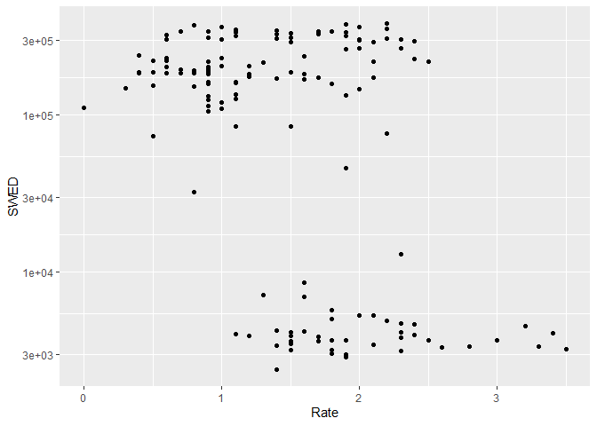
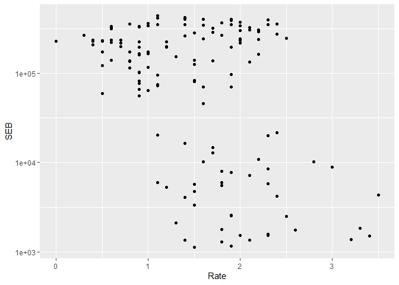
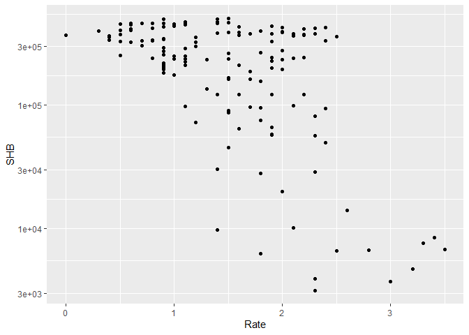

HW1
================

## Previous experience

I have used R for matrix operations as a supplement to SQl querying at
an internship. I have experience in the other tools.

## Inflation rate vs stored cash at the central bank

Data has been downloaded from SCB in Excel format. Empty lines and
comments were removed, the tables transposed, and the data exported to a
csv file. The data refers to the inflation rate (KPIF) for the months
2008M01 to 2019M08, as well as Sweden’s three major banks’ reported
funds at the Riksbank.

## Results

<!-- --><!-- --><!-- -->

``` r
sessionInfo()
```

    ## R version 3.6.1 (2019-07-05)
    ## Platform: x86_64-w64-mingw32/x64 (64-bit)
    ## Running under: Windows 10 x64 (build 18362)
    ## 
    ## Matrix products: default
    ## 
    ## locale:
    ## [1] LC_COLLATE=English_United Kingdom.1252 
    ## [2] LC_CTYPE=English_United Kingdom.1252   
    ## [3] LC_MONETARY=English_United Kingdom.1252
    ## [4] LC_NUMERIC=C                           
    ## [5] LC_TIME=English_United Kingdom.1252    
    ## 
    ## attached base packages:
    ## [1] stats     graphics  grDevices utils     datasets  methods   base     
    ## 
    ## other attached packages:
    ##  [1] reshape2_1.4.3  forcats_0.4.0   stringr_1.4.0   dplyr_0.8.3    
    ##  [5] purrr_0.3.3     readr_1.3.1     tidyr_1.0.0     tibble_2.1.3   
    ##  [9] ggplot2_3.2.1   tidyverse_1.2.1
    ## 
    ## loaded via a namespace (and not attached):
    ##  [1] Rcpp_1.0.2       plyr_1.8.4       cellranger_1.1.0 pillar_1.4.2    
    ##  [5] compiler_3.6.1   tools_3.6.1      zeallot_0.1.0    digest_0.6.22   
    ##  [9] lubridate_1.7.4  jsonlite_1.6     evaluate_0.14    lifecycle_0.1.0 
    ## [13] nlme_3.1-140     gtable_0.3.0     lattice_0.20-38  pkgconfig_2.0.3 
    ## [17] rlang_0.4.1      cli_1.1.0        rstudioapi_0.10  yaml_2.2.0      
    ## [21] haven_2.1.1      xfun_0.10        withr_2.1.2      xml2_1.2.2      
    ## [25] httr_1.4.1       knitr_1.25       hms_0.5.2        generics_0.0.2  
    ## [29] vctrs_0.2.0      grid_3.6.1       tidyselect_0.2.5 glue_1.3.1      
    ## [33] R6_2.4.0         readxl_1.3.1     rmarkdown_1.16   modelr_0.1.5    
    ## [37] magrittr_1.5     backports_1.1.5  scales_1.0.0     htmltools_0.4.0 
    ## [41] rvest_0.3.4      assertthat_0.2.1 colorspace_1.4-1 labeling_0.3    
    ## [45] stringi_1.4.3    lazyeval_0.2.2   munsell_0.5.0    broom_0.5.2     
    ## [49] crayon_1.3.4
