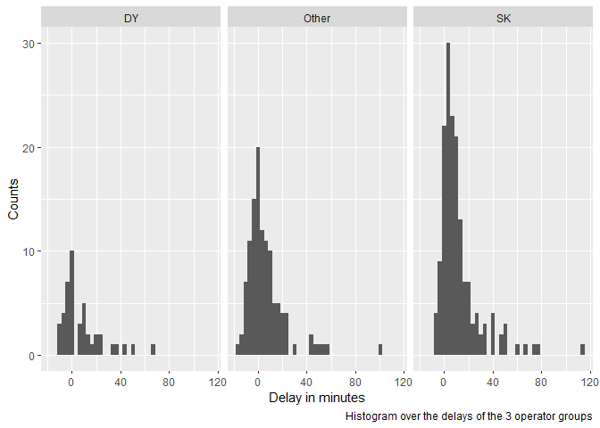
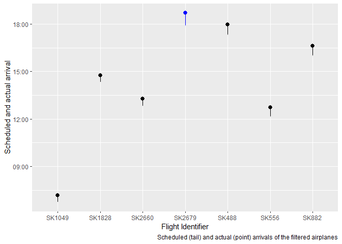
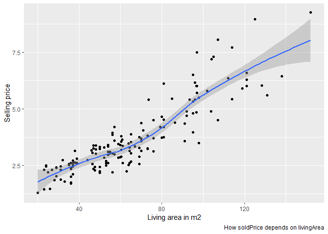
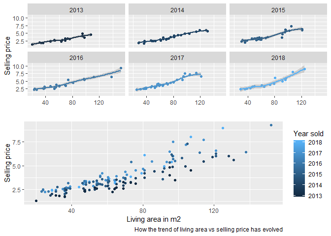
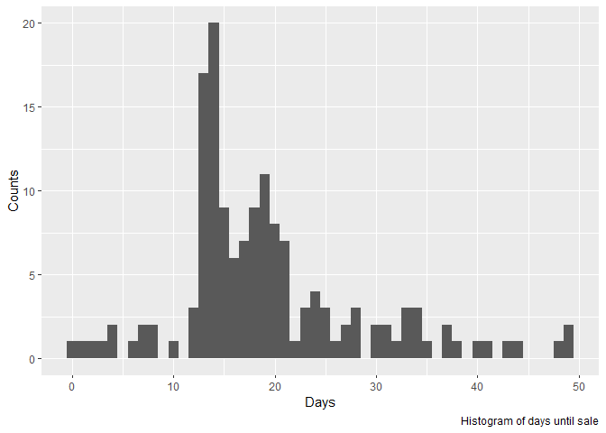
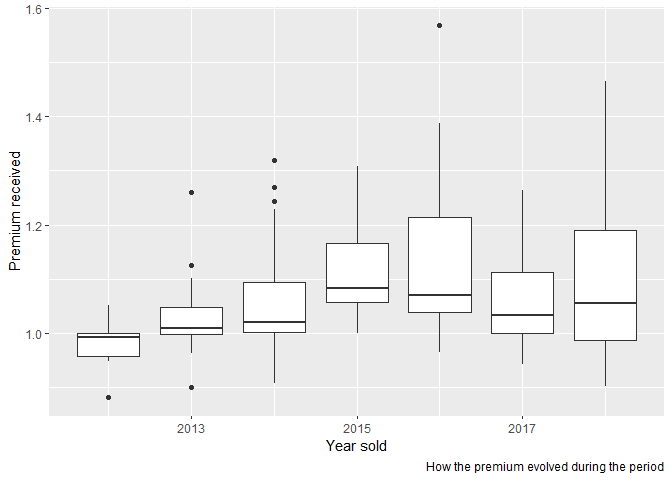

HW2: Basic tidyverse
================

# Exercise 1: Departures and Landings at Arlanda Airport

#### How many departing flights were cancelled at Arlanda that day? Which airline had most cancelations?

``` r
swedavia <- load("../HW_data/swedavia_arn_2019-11-08.RData")
canceled_flights <- arn_departures %>%
  filter(locationAndStatus_flightLegStatus == "CAN") %>%
  group_by(airlineOperator_icao) %>%
  summarise(
    count = n()
  ) %>%
  arrange(desc(count))
```

Number of cancelled flights is `sum(canceled_flights$count)`= 9. Airline
with the most cancelled flights is
`head(canceled_flights$airlineOperator_icao,1)` = DLH.

#### Determine the 3 airports with most connections departing from ARN to them on 2019-11-08.

``` r
connections <- arn_departures %>%
  group_by(flightLegIdentifier_arrivalAirportIata) %>%
  summarise(
    count = n()
  ) %>%
  arrange(desc(count))
```

Top 3 airports with most connections are displayed in the following
table:

``` r
knitr::kable(head(connections, 3), caption = "Airports with the most connections")
```

| flightLegIdentifier\_arrivalAirportIata | count |
| :-------------------------------------- | ----: |
| CPH                                     |    21 |
| OSL                                     |    21 |
| HEL                                     |    20 |

Airports with the most connections

#### Add an extra column delay in the departures data, which contains the difference in minutes between the scheduled departure time and the actual departure time.

This is done by the following code.

``` r
time_diff <- arn_departures %>%
  filter(locationAndStatus_flightLegStatus != "CAN", locationAndStatus_flightLegStatus != "DEL") %>%
  mutate(delay = (ymd_hms(departureTime_scheduledUtc) - ymd_hms(departureTime_actualUtc)) / 60) %>%
  mutate(delay = -as.double(delay))
```

#### Create an additional column airline3 in the departure dataset, which contains a factor with three levels: “DY” if the airline is Norwegian, “SK” if the airline is SAS and “Other” for any other airline.

This is done by the following code.

``` r
nor_swe <- time_diff %>%
  mutate(airline3 = case_when(
    airlineOperator_icao == "NAX" ~ "DY",
    airlineOperator_icao == "SAS" ~ "SK",
    TRUE ~ "Other"
  ))
```

#### Compute the median delay for each airline category of airline3. Interpret the result

``` r
median_delay <- nor_swe %>%
  group_by(airline3) %>%
  summarise(
    median(delay)
  )
```

``` r
knitr::kable(median_delay, caption = "Median delay of Norwegian, SAS, and all others")
```

| airline3 | median(delay) |
| :------- | ------------: |
| DY       |     0.8916667 |
| Other    |     2.1500000 |
| SK       |     7.1333333 |

Median delay of Norwegian, SAS, and all others

SAS has the most problems with a median delay of 7.13 minutes. Norwegian
are almost perfect with 0.892 minutes, and other carriers have a median
delay of 2.15 minutes.

#### For each of the 3 categories of airline3 create a histogram of the delays in minutes.

``` r
ggplot(nor_swe, aes(x = delay)) +
  geom_histogram(bins = 40) +
  facet_wrap(~airline3) +
  labs(
    x = "Delay in minutes",
    y = "Counts",
    caption = "Histogram over the delays of the 3 operator groups"
  )
```

<!-- -->

#### My flight back to Berlin on 2019-11-08 was SK2679. When did it actually depart from Arlanda?

``` r
berlin_flight <- time_diff %>%
  mutate(clean_departureUTC = as.POSIXct(gsub("T|Z", " ", departureTime_actualUtc), tz = "UTC")) %>%
  mutate(clean_scheduled_UTC = as.POSIXct(gsub("T|Z", " ", departureTime_scheduledUtc), tz = "UTC")) %>%
  filter(flightId == "SK2679")

time_utc <- as.POSIXct(
  gsub("T|Z", " ", berlin_flight$departureTime_actualUtc),
  tz = "UTC"
)
time_cet <- with_tz(time_utc, tzone = "CET")
```

It departed at `time_cet` = 2019-11-08 19:41:38.

#### The reason for the delay in departure was that SK2679 was waiting for passengers (and the pilots\!) from another delayed SAS flight arriving late in Arlanda. Which airport do you suspect the delayed flight came from? Explain your investigative approach in words before substantiating your answer by data and code.

My approach is to narrow down the data twice:

1.  The arriving flight must have a delay that is shorter than the delay
    of the departing flight.
      - Ansatz: the departing flight has at most twice the delay of the
        arriving one.
2.  The arriving plane needs to arrive before the departing plane
    departs.

Both conditions are expressed in a `filter()`:

``` r
late_flight <- arn_arrivals %>%
  mutate(delay = (ymd_hms(arrivalTime_scheduledUtc) - ymd_hms(arrivalTime_actualUtc)) / 60) %>%
  mutate(delay = -as.double(delay)) %>%
  mutate(clean_arrivalUTC = as.POSIXct(gsub("T|Z", " ", arrivalTime_actualUtc), tz = "UTC")) %>%
  mutate(clean_scheduled_UTC = as.POSIXct(gsub("T|Z", " ", arrivalTime_scheduledUtc), tz = "UTC")) %>%
  filter(
    airlineOperator_icao == "SAS",
    between(delay, berlin_flight$delay / 2, berlin_flight$delay),
    clean_arrivalUTC - time_utc <= 0
  )
```

We can visualize this data by a point range plot:

``` r
ggplot() +
  geom_pointrange(late_flight,
    mapping = aes(
      x = flightId,
      y = clean_arrivalUTC,
      ymin = clean_arrivalUTC,
      ymax = clean_scheduled_UTC
    ),
    color = "black"
  ) +
  geom_pointrange(berlin_flight,
    mapping = aes(
      x = flightId,
      y = clean_departureUTC,
      ymin = clean_departureUTC,
      ymax = clean_scheduled_UTC,
    ),
    color = "blue"
  ) +
  labs(
    x = "Flight Identifier",
    y = "Scheduled and actual arrival",
    caption = "Scheduled (tail) and actual (point) arrivals of the filtered airplanes"
  )
```

<!-- -->

Here, the scheduled time for arrival/departure is the tail. The actual
time for arrival/departure is the head. We see that SK488 is the most
probable candidate, since its head is within the body of the departing
flight in blue.

# Exercise 2: Apartment prices

#### Illustrate how Soldprice depends on Livingarea with a suitable figure

``` r
soldprice_livingarea <- booli %>%
  mutate(soldPrice = soldPrice / 1000000) %>%
  mutate(soldYear = as.POSIXct(soldDate) %>% lubridate::year())
ggplot(soldprice_livingarea, aes(x = livingArea, y = soldPrice)) +
  geom_point() +
  geom_smooth() +
  labs(
    x = "Living area in m2",
    y = "Selling price",
    caption = "How soldPrice depends on livingArea"
  )
```

<!-- -->

#### Illustrate trends in Soldprice over the period.

``` r
exclude_2012 <- soldprice_livingarea %>% # Excluding year == 2012 because it only contains 3 data points
  filter(soldYear != 2012)
facet <- ggplot(exclude_2012, aes(x = livingArea, y = soldPrice, color = soldYear)) +
  geom_point() +
  geom_smooth() +
  facet_wrap(~soldYear) +
  labs(
    x = "",
    y = "Selling price"
  ) +
  theme(legend.position = "none")

colors <- ggplot(exclude_2012, aes(x = livingArea, y = soldPrice, color = soldYear)) +
  geom_point() +
  labs(
    x = "Living area in m2",
    y = "Selling price",
    caption = "How the trend of living area vs selling price has evolved",
    color = "Year sold"
  )
grid.arrange(facet, colors, nrow = 2)
```

<!-- -->

Here we have two different illustrations of the same phenomenon: the
price per square meter has increased over the years. We can see this as
the slope of the fitted curves in the facets increasing, or that the
lower graph is clearly separated into dark and bright colors, i.e. the
years.

#### Illustrate an aspect of data using a table.

Here, I wanted to bucket the number of days required for an object to
sell, and compare that to the `mean_premium`, i.e. the mean fraction
`soldPrice/listPrice` as a decimal. This way, we can see which time
bucket has the highest mean premium\! An couple of objects had a premium
below 1, i.e. a discount. However, this is not seen when bucketing,
since the discounted objects were few.

``` r
premium_soldTime <- soldprice_livingarea %>%
  mutate(
    soldTime = ymd(soldDate) - ymd(substr(published, 1, 10)),
    premium = 1000000 * soldPrice / listPrice,
    soldTimeBucket = case_when(
      floor(soldTime / 5) == 0 ~ "0-4",
      floor(soldTime / 5) == 1 ~ "5-9",
      floor(soldTime / 5) == 2 ~ "10-14",
      floor(soldTime / 5) == 3 ~ "15-19",
      TRUE ~ "20-"
    )
  ) %>%
  filter(soldTime < 50) # Remove outliers


premium_soldTime_bucket <- premium_soldTime %>%
  group_by(soldTimeBucket) %>%
  summarize(
    mean_premium = mean(premium)
  ) %>%
  select(mean_premium, soldTimeBucket) %>%
  arrange(desc(mean_premium))
```

The result is presented in the table:

``` r
knitr::kable(premium_soldTime_bucket, caption = "The mean premium received when selling")
```

| mean\_premium | soldTimeBucket |
| ------------: | :------------- |
|      1.138277 | 10-14          |
|      1.101480 | 5-9            |
|      1.078270 | 15-19          |
|      1.058583 | 20-            |
|      1.051678 | 0-4            |

The mean premium received when selling

We can conclude that the highest `mean_premium`, 1.138277, occurs in the
time bucket 10-14. So if your listing has been up for more than 2 weeks,
you should consider relisting it.

#### Illustrate an aspect of data using a histogram.

``` r
ggplot(premium_soldTime, aes(x = as.numeric(soldTime))) +
  geom_histogram(binwidth = 1) +
  labs(
    x = "Days",
    y = "Counts",
    caption = "Histogram of days until sale"
  )
```

<!-- -->

This is the unbucketed data of the `soldTime` from previously. The data
can be bucketed again by varying the `binwidth` parameter, which now is
1, i.e. unbucketed.

#### llustrate an aspect of data using a boxplot

``` r
list_vs_sold <- soldprice_livingarea %>%
  mutate(listPrice = listPrice / 1000000) %>%
  mutate(premium = soldPrice / listPrice)
ggplot(list_vs_sold, aes(x = soldYear, y = premium, group = soldYear)) +
  geom_boxplot() +
  labs(
    x = "Year sold",
    y = "Premium received",
    caption = "How the premium evolved during the period"
  )
```

<!-- -->

Here we see that all objects sold in 2015 were sold to a premium. The
downward trend since then might have been broken in 2018, with the mean
actually reverting, but the spread increasing.
