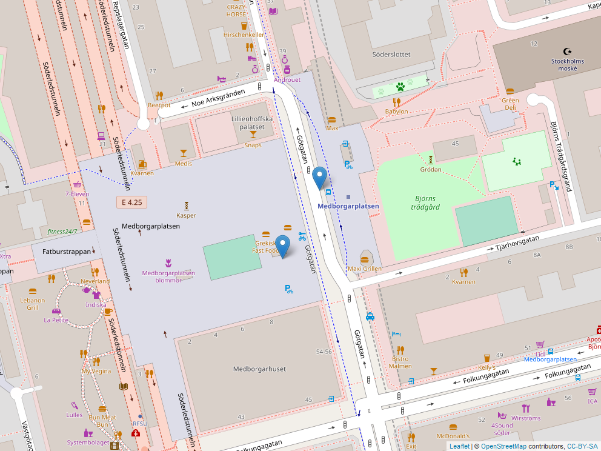

```{r setup, include=FALSE}
knitr::opts_chunk$set(tidy = "styler")
```


```{r eval=TRUE, echo=FALSE}
suppressPackageStartupMessages(library(tidyverse))
suppressPackageStartupMessages(library(RSQLite))
suppressPackageStartupMessages(library(leaflet))
suppressPackageStartupMessages(library(mapview))
``` 

# Exercise 1: Long and wide at Statistics Sweden
#### Choose a table that is on wide format (see textbook), convert it to long format using gather and illustrate something that is easier to do in the latter format.

From [SCB](http://www.statistikdatabasen.scb.se/sq/78600), we can get a table containing monthly YTD household lending (Utlåning till hushåll), and money supply (M1) in Sweden. In its raw format, each month is its own variable, which is the definition of the "wide" format. Thus, we need to gather the time variables to the "long" format as done below.
```{r eval=TRUE, echo=TRUE}
scb_long <- read.table(file = "FM5001AC.csv", sep="\t", header = TRUE) %>%
  gather("X2019M01":"X2019M09",
         key = "month",
         value = "percent")

knitr::kable(scb_long, caption = "Long table from SCB using `gather()`")

ggplot(scb_long,aes(x = month, y = percent, fill = ekonomisk.indikator)) +
  geom_bar(position = "dodge", stat = "identity") +
  theme(axis.text.x = element_text(angle = 90)) +
  labs(
    x = "Month",
    y = "Increase MoM",
    caption = "Monthly increase in household lending and money supply (M1)",
    fill = "Indicator type"
  )
```

#### Choose a table that has variables as rows (e.g. separate rows for men and women), turn it into tidy format using spread and illustrate something that is easier to do in the latter format.

From [SCB](http://www.statistikdatabasen.scb.se/sq/78599), we get a table containing the number of suicides in Sweden from 1990 to 1996 for men and women. First, as in the previous example, we `gather()` the time variables. 
```{r eval=TRUE, echo=TRUE}
scb1_long <- read.table(file = "HS0301A1.csv", sep="\t", header = TRUE) %>%
  gather("X1990",
         "X1991",
         "X1992",
         "X1993",
         "X1994",
         "X1995",
         "X1996",
         key = "year",
         value = "count") %>%
  select(-dödsorsak)

knitr::kable(scb1_long, caption = "Long table from SCB using `gather()`")
```

Then, we `spead()` the genders, since the variable `count` contains values from multiple variables (i.e. the two genders). The result is a tidy dataframe where each gender has its own variable, and the all years are gathered under a single variable `year`.
```{r eval=TRUE, echo=TRUE}
scb1_wide <- scb1_long %>%
  spread(key = kön, value = count)

knitr::kable(scb1_wide, caption = "Tidy table from SCB using `spread()`")

ggplot(scb1_wide,aes(x = year, y = män)) +
  geom_bar(position= "dodge", stat = "identity") +
  theme(axis.text.x = element_text(angle = 90)) +
  labs(x = "Year",
       y = "Number of male suicides",
       caption = "Number of male suicides per year in Sweden")
```

# Exercise 2: SL lines
#### Figure out and describe how the tables relate to eachother.
We have the following tables: `sites`, `stopPoints`, `lines`, `journeyPatterns`, and `transportmodes`. `transportmodes` is a dictionary between the `DefaultTransportModeCode` and `StopAreaTypeCode` for transating the codes in `lines` and `stopPoints`, repsectively.
`sites` and `stopPoints` is linked with `StopAreaNumber` or `StopPointNumber`. `StopPointNumber` links each `lines` to each `stopPoints`.

#### Pull all data from the SQLite database into R as data.frames using the RSQLite package.
The following code from the Internet loads the dataframes into the vector lDataFrames.
```{r eval=TRUE, echo=FALSE}
con <- dbConnect(drv=RSQLite::SQLite(), dbname="../HW_data/sl-api.sqlite")

tables <- dbListTables(con)

journeyPatterns <- dbGetQuery(conn=con, statement=paste("SELECT * FROM '", tables[[1]], "'", sep=""))
lines <- dbGetQuery(conn=con, statement=paste("SELECT * FROM '", tables[[2]], "'", sep=""))
sites <- dbGetQuery(conn=con, statement=paste("SELECT * FROM '", tables[[3]], "'", sep=""))
stopAreas <- dbGetQuery(conn=con, statement=paste("SELECT * FROM '", tables[[4]], "'", sep=""))
stopPoints <- dbGetQuery(conn=con, statement=paste("SELECT * FROM '", tables[[5]], "'", sep=""))
transportmodes <- dbGetQuery(conn=con, statement=paste("SELECT * FROM '", tables[[6]], "'", sep=""))
```

Convert `SiteId`, `StopPointNumber` and `StopAreaNumber` to integers.
```{r eval=TRUE, echo=FALSE}
sites <- sites %>%
  mutate(SiteId = as.integer(SiteId)) %>%
  mutate(StopAreaNumber = as.integer(StopAreaNumber))

stopAreas <- stopAreas %>%
  mutate(StopPointNumber = as.integer(StopPointNumber)) %>%
  mutate(StopAreaNumber = as.integer(StopAreaNumber))

stopPoints <- stopPoints %>%
  mutate(StopPointNumber = as.integer(StopPointNumber)) %>%
  mutate(StopAreaNumber = as.integer(StopAreaNumber))

journeyPatterns <- journeyPatterns %>%
  mutate(JourneyPatternPointNumber = as.integer(JourneyPatternPointNumber))
```

#### Consider the `stopAreas` and `stopPoints` tables and comment on the sparsity of this data presentation, e.g., are there any (unecessary) redudancies?. Suggest a more sparse data model for the stopAreas table and perform the appropriate table operations to obtain this sparser representation and store it in the data.frame `stopAreas_sparse`. Explain how one would get the original `stopAreas` data.frame using joins.

In `stopAreas`, each `StopPointName`-`StopAreaTypeCode` pair is linked to a unique `StopPointNumber`. Hence, for multiple instances of a `StopPointNumber` with the same `StopAreaTypeCode`, the sucessive `StopPointName` can be omitted. An example that illustrates this redundancy is given below.

```{r eval=TRUE, echo=TRUE}
stopAreas_small <- stopAreas %>%
  filter(StopPointName == "Gullmarsplan")
```

#### Present a table of the number of active unique rail traffic stops (i.e. train, tram or metro stops in each ticket zone (ZoneShortName in stopAreas/stopPoints). By “active” we mean stops that are part of the journey pattern of a line.

```{r eval=TRUE, echo=TRUE}
stopPoints_active_grouped <- stopPoints %>%
  filter(
    StopPointNumber %in% journeyPatterns$JourneyPatternPointNumber, # Active stopPoints
    StopAreaTypeCode %in% c("TRAMSTN", "METROSTN", "RAILWSTN") # only rail stopPonts
         ) %>%
  group_by(ZoneShortName) %>%
  summarize(
    count = n()
    )
knitr::kable(stopPoints_active_grouped, caption = "Table of number of active rail stoppoints, grouped by zone")
```

#### Choose a line, and plot the stops as points on a map with the name of each stop as a label. Write the code in such a way that it is easily reusable if you want to plot another line.
For reusability, we define the function `line()`, which takes the line number as integer, and produces a filtered dataframe from `journeyPatterns`. If the output were a shiny html instead of a md, we could have the user herself declaring the bus-lie of interest using this function.
```{r eval=TRUE, echo=TRUE}
line <- function(line_number) { # FUnction for easy reusability
  `journeyPatterns` %>% 
  filter(
      LineNumber == as.character(line_number),
      DirectionCode == "1") # Pick only one direction for clarity 
}
```

The coordinates in this dataframe is then used to generate a png-file. Below is the code and resulting png used to generate the map of the busline 4 in one direction.
```{r eval=TRUE, echo=TRUE}
coordinates <- stopPoints %>%
  mutate(
    lon = as.numeric(LocationEastingCoordinate),
    lat = as.numeric(LocationNorthingCoordinate),
    name = StopPointName
    ) %>%
  filter(
    StopAreaTypeCode == "BUSTERM", # Only buses for now
    StopPointNumber %in% line(4)$JourneyPatternPointNumber, # stopPoints of line 4
    )
leaflet(coordinates) %>% 
  addTiles() %>%  
  addMarkers(lng=~lon, lat=~lat, popup = ~name) %>%
  mapshot(file = "Leaflet-plot.png")
knitr::include_graphics("Leaflet-plot.png")
```

# Exercise 3: Using the SL lines with a reseplan
#### From where to where is the journey? How would you answer the question using the sites table from Exercise 2?
Inspect the `Origin$name` variable:
```{r eval=TRUE, echo=TRUE}
data <- load("../HW_data/reseplaner-2019-11-17.RData")
knitr::kable(trips$LegList$Leg[[1]]$Origin$name, caption = "`Origin$name` of the data")
```

This seems to be a variable of the starting points of the connections. Hence, the trip starts at `r head(trips$LegList$Leg[[1]]$Origin$name,1)`.
Inspect the `Destination$name` variable:
```{r eval=TRUE, echo=TRUE}
knitr::kable(trips$LegList$Leg[[1]]$Destination$name, caption = "`Destination$name` of the data")
```
This seems to be a table of the ending points of the connections. Hence, the trip ends at `r tail(trips$LegList$Leg[[1]]$Destination$name,1)`.

In both `Origin` and `Destination`, there seems to be a variable `mainMastExtId` that contains the `siteId` from previous exercise.
```{r eval=TRUE, echo=TRUE}
trips$LegList$Leg[[1]]$Origin$mainMastExtId
```
Stripping the first entry of the 5 leading numbers, we get `r substr(head(trips$LegList$Leg[[1]]$Origin$mainMastExtId,1),6,100)`. it corresponds to `r head(trips$LegList$Leg[[1]]$Origin$name,1)` and its `siteId`. Doing the same for `Destination`, we get the `siteId` `r substr(tail(trips$LegList$Leg[[1]]$Destination$mainMastExtId,1),6,100)`. Let's check that this indeed corresponds to `r tail(trips$LegList$Leg[[1]]$Destination$name,1)`:
```{r eval=TRUE, echo=TRUE}
sites1 <- sites %>%
  filter(SiteId == 
           substr(tail(trips$LegList$Leg[[1]]$Destination$mainMastExtId,1),6,100)
         )

coordinates1 <- stopPoints %>%
  mutate(
    lon = as.numeric(LocationEastingCoordinate),
    lat = as.numeric(LocationNorthingCoordinate),
    name = StopPointName
    ) %>%
  filter(
    StopPointNumber %in% sites1$StopAreaNumber,
    )
leaflet(coordinates1) %>% 
  addTiles() %>%  
  addMarkers(lng=~lon, lat=~lat, popup = ~name) %>%
  mapshot(file = "Leaflet-plot1.png")

```
Which is a map over `r sites1$SiteName[1]`, `r tail(trips$LegList$Leg[[1]]$Destination$name,1)` as expected!

#### When one would arrive at the destination?
`trips$LegList$Leg[[i]]` contains the i:th suggested trip. We can assume that `i = 1` gives us the shortest trip, because this is the standard setting in most apps (i.e. sorting by shortest travel time). This can of course also be checked by printing `trips$LegList$Leg[[i]]`. However, under this assumption, the time is then:
```{r eval=TRUE, echo=TRUE}
tail(trips$
       LegList$
        Leg[[1]]$
          Destination$
            time,1)
```

#### Provide a list of all stops that one travels through during the journey.
We need to iterate twice: first list all the stops for one connection, and then list all connections. This can be done using the following nested for-loop.
```{r eval=TRUE, echo=TRUE}
for(j in 1:length(trips$
                    LegList$
                      Leg[[1]]$
                        Stops$
                          Stop
                  )){
  for (i in trips$
              LegList$
                Leg[[1]]$
                  Stops$
                    Stop[[j]]$
                      name){
    print(i)
  }}
```
Each repetition signals a change of connection. Unfortunately, the $-structure is not in tidy format, and is quite hard to read.

