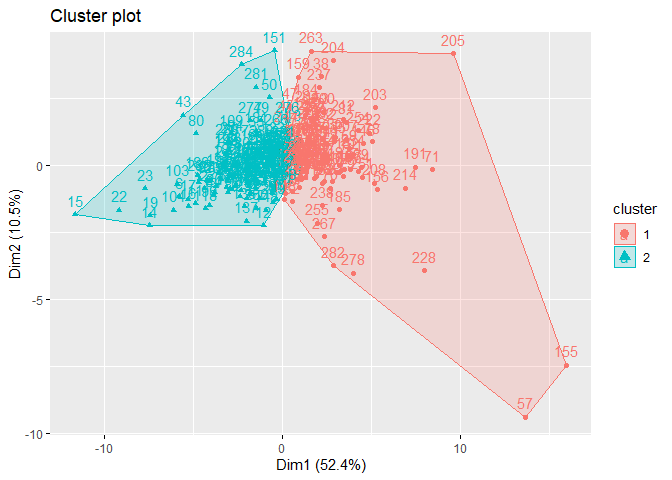

HW4: Cubing regexps and 6th graders
================

# Exercise 1: Rubik’s cube algorithms and regular expressions

#### Write `stringr` code, which counts the number of moves in the above T-perm algorithm.

``` r
t_perm <- "R U R' U' R' F R2 U' R' U' R U R' F'"
turns <- str_count(t_perm, " ") + 1
turns
```

    ## [1] 14

#### Your task is to use regular expressions and stringr functionality to parenthesize these known sub-sequences in the above T-perm algorithm.

Define `s1` and `s2` as the groups to be matched, and `r` as the
replacement. We then first match all `s1`, pass the grouped permutation
to the matcher again, telling it to match `s2` this time around.

``` r
s1 <- "(R U R' U')"
s2 <- "(R U R' F')"
r <- "(\\1)"
group_s1 <- str_replace_all(t_perm, s1, r)
group_s1
```

    ## [1] "(R U R' U') R' F R2 U' R' U' R U R' F'"

``` r
group_s2 <- str_replace(group_s1, s2, r)
group_s2
```

    ## [1] "(R U R' U') R' F R2 U' R' U' (R U R' F')"

Check that this works for the J perm aswell:

``` r
j_perm <- "R U R' F' R U R' U' R' F R2 U' R' U'"
group_s1_j <- str_replace(j_perm, s1, r)
group_s2_j <- str_replace(group_s1_j, s2, r)
group_s2_j
```

    ## [1] "(R U R' F') (R U R' U') R' F R2 U' R' U'"

#### Write `stringr` code which given an algorithm alg (represented as a character vector) returns the inverse of the algorithm as a character vector

We need to perform two operations: mirroring and inverting. The mirrored
string is given from:

``` r
alg <- "U R U' R' R2"
splits <- str_split(alg, "")[[1]]
reversed <- rev(splits)
mirror <- paste(reversed, collapse = "")
mirror
```

    ## [1] "2R 'R 'U R U"

Now we need to invert every element. Start by adding a ’ to each single
letter that doesn’t have a ’ in front of it:

``` r
inverted <- str_replace_all(mirror, "( \\w)", "\\1'")
inverted
```

    ## [1] "2R 'R 'U R' U'"

Now we remove all ’ that precedes a letter, :

``` r
one <- str_replace_all(inverted, "'(\\w)", "\\1")
one
```

    ## [1] "2R R U R' U'"

Finally we need to handle the half turns. As of now, R2 becomes 2R. So
our final replacement is:

``` r
final <- str_replace_all(one, "2(\\w)", "\\12")
final
```

    ## [1] "R2 R U R' U'"

# Exercise 2: Skoleverket’s information about 6th graders

#### Read the data into R and restrict your attention to the results of “Samtliga” schools for each municipality.

It seems that there are rows we can use as headers, 5 and 6. Row 6 has
some duplicate column names, which we can remedy by merging the column
names from row 5. This is done by the following code.

``` r
header_1 <- read_csv2("../HW_data/exp_betyg_ak6_kommun_2018_19.csv", skip = 5, n_max = 1, col_names = FALSE) %>%
  replace(is.na(.), "")

header_2 <- read_csv2("../HW_data/exp_betyg_ak6_kommun_2018_19.csv", skip = 6, n_max = 1, col_names = FALSE) %>%
  replace(is.na(.), "")

betyg_wrong_header <- read_csv2("../HW_data/exp_betyg_ak6_kommun_2018_19.csv", skip = 6, col_names = TRUE)

old_header <- c(colnames(betyg_wrong_header))
new_header <- paste(header_1, header_2)
colnames(betyg_wrong_header) <- str_replace(new_header, "(^ )", "") # fix trailing spaces and rename header
betyg_correct_header <- betyg_wrong_header
knitr::kable(head(betyg_correct_header))
```

| Kommun   | Kommun-kod | Län                  | Läns-kod | Typ av huvudman | Ämne | Antal elever Totalt | Antal elever Flickor | Antal elever Pojkar | Andel (%) med A-E Totalt | Andel (%) med A-E Flickor | Andel (%) med A-E Pojkar | Genomsnittlig betygspoäng Totalt | Genomsnittlig betygspoäng Flickor | Genomsnittlig betygspoäng Pojkar |    |
| :------- | :--------- | :------------------- | :------- | :-------------- | :--- | :------------------ | :------------------- | :------------------ | :----------------------- | :------------------------ | :----------------------- | :------------------------------- | :-------------------------------- | :------------------------------- | -- |
| Ale      | 1440       | Västra Götalands län | 14       | Samtliga        | Bild | 415                 | 219                  | 196                 | 98,8                     | \~100                     | \~100                    | 13,8                             | 15,5                              | 11,9                             | NA |
| Ale      | 1440       | Västra Götalands län | 14       | Kommunal        | Bild | 393                 | 207                  | 186                 | 98,7                     | \~100                     | \~100                    | 13,8                             | 15,5                              | 11,9                             | NA |
| Ale      | 1440       | Västra Götalands län | 14       | Enskild         | Bild | 22                  | 12                   | 10                  | 100,0                    | 100,0                     | 100,0                    | 14,0                             | 15,0                              | 12,8                             | NA |
| Alingsås | 1489       | Västra Götalands län | 14       | Samtliga        | Bild | 530                 | 262                  | 268                 | 98,3                     | \~100                     | ..                       | 14,1                             | 15,4                              | 12,9                             | NA |
| Alingsås | 1489       | Västra Götalands län | 14       | Kommunal        | Bild | 433                 | 207                  | 226                 | 98,2                     | \~100                     | ..                       | 14,3                             | 15,6                              | 13,2                             | NA |
| Alingsås | 1489       | Västra Götalands län | 14       | Enskild         | Bild | 97                  | 55                   | 42                  | \~100                    | 100,0                     | \~100                    | 13,4                             | 14,7                              | 11,6                             | NA |

Now we start cleaning the data.

1.  Remove the last column (since it’s empty), and `Kommun`, `Län`, and
    `Läns-kod`.
2.  Remove the drill-down on public/private schools (since we only care
    about the aggregate grades).
3.  Replace “.” with NA according to the
    [documentation](https://siris.skolverket.se/siris/ris.visa_analysstod?psRapport=gr6_betyg_amne&psAr=2019&psVerkformkod=11).
4.  Replace the current decimal comma with the regular period. This is
    an artefact from the usage of `read_csv2()`.
5.  Rremove the space used as a thousands separator.

<!-- end list -->

``` r
betyg1 <- betyg_wrong_header %>%
  select(-"", -Kommun, -Län, -`Läns-kod`) %>% # 1. strip irrelevant columns

  filter(`Typ av huvudman` == "Samtliga") %>% # 2. No reason to keep data on public/private school.
  select(-`Typ av huvudman`) %>% # 2.  strip irrelevant column

  replace(. == ".", NA) %>% # 3. rename . to NA

  mutate_all(funs(str_replace(., ",", "."))) %>% # 4. replace , with .

  mutate(`Antal elever Totalt` = sub("\\s+", "", `Antal elever Totalt`)) %>% # 5. remove 1000's delimiter for "`Antal elever..."
  mutate(`Antal elever Pojkar` = sub("\\s+", "", `Antal elever Pojkar`)) %>%
  mutate(`Antal elever Flickor` = sub("\\s+", "", `Antal elever Flickor`))
knitr::kable(head(betyg1))
```

| Kommun-kod | Ämne | Antal elever Totalt | Antal elever Flickor | Antal elever Pojkar | Andel (%) med A-E Totalt | Andel (%) med A-E Flickor | Andel (%) med A-E Pojkar | Genomsnittlig betygspoäng Totalt | Genomsnittlig betygspoäng Flickor | Genomsnittlig betygspoäng Pojkar |
| :--------- | :--- | :------------------ | :------------------- | :------------------ | :----------------------- | :------------------------ | :----------------------- | :------------------------------- | :-------------------------------- | :------------------------------- |
| 1440       | Bild | 415                 | 219                  | 196                 | 98.8                     | \~100                     | \~100                    | 13.8                             | 15.5                              | 11.9                             |
| 1489       | Bild | 530                 | 262                  | 268                 | 98.3                     | \~100                     | ..                       | 14.1                             | 15.4                              | 12.9                             |
| 0764       | Bild | 243                 | 114                  | 129                 | \~100                    | 100.0                     | \~100                    | 13.1                             | 14.7                              | 11.7                             |
| 0604       | Bild | 77                  | 40                   | 37                  | 92.2                     | \~100                     | ..                       | 12.6                             | 13.8                              | 11.3                             |
| 1984       | Bild | 145                 | 63                   | 82                  | \~100                    | \~100                     | \~100                    | 14.4                             | 16.7                              | 12.7                             |
| 2506       | Bild | 25                  | 14                   | 11                  | \~100                    | 100.0                     | \~100                    | 12.2                             | 13.9                              | 10.0                             |

Now we handle the two cases that are going to have to be approximated.

In the “Antal…” columns, “..” means a value below 10. If we approximate
each of those values to be 5, the total number of students will then
always be 10, even though the column for the total number of students
will display a different value. This could be improved\! Instead, assume
that the genders are evenly distributed, thus giving `Antal elever
Flickor` = `Antal elever Totalt` / 2.

``` r
betyg1_numeric <- betyg1 %>%
  replace(. == "..", 5.1) %>% # pick a random numerical value for conversion to succeed
  replace(. == "~100", 99.9) %>% # pick a random numerical value for conversion to succeed
  mutate_at(colnames(betyg1[c(1, 3:11)]), as.numeric) # convert all numerical columns to num

betyg1_numeric <- betyg1_numeric %>%
  mutate(`Antal elever Flickor` = case_when(
    `Antal elever Flickor` == 5.1 ~ `Antal elever Totalt` / 2,
    TRUE ~ `Antal elever Flickor`
  )) %>%
  mutate(`Antal elever Pojkar` = case_when(
    `Antal elever Pojkar` == 5.1 ~ `Antal elever Totalt` / 2,
    TRUE ~ `Antal elever Pojkar`
  ))
```

Furthermore, the occurence of a “\~100” in one of the “Andel…” columns
is approximated using the fact that, on average, girls will contribute
more to the passing grades than boys since girls perform better in
school. The `mutate()` clause below follows this logic:

1.  In `Andel (%) med A-E Totalt`, a “\~100” means that 1-4 students
    failed.
      - On average, 2 students fail, giving new value (`Antal elever
        Totalt` - 2)/`Antal elever Totalt`
2.  In `Andel (%) med A-E Flickor` and `Andel (%) med A-E Pojkar`, a
    “\~100” or “..” means that 1-4 students failed in either column.
      - Since we assumed that 2 students failed, and know that boys fail
        more often than girls, let 1.5 boys fail, giving the fraction of
        girls passing as (`Andel (%) med A-E Totalt` \* `Antal elever
        Totalt` - (`Antal elever Pojkar` - 1.5)) / `Antal elever
        Flickor`.
      - Thus, 0.5 girls failed and fraction of boys passing is (`Andel
        (%) med A-E Totalt` \* `Antal elever Totalt` - (`Antal elever
        Flickor` - 0.5)) / `Antal elever Pojkar`

<!-- end list -->

``` r
betyg1_numeric <- betyg1_numeric %>%
  mutate(`Andel (%) med A-E Totalt` = case_when(
    `Andel (%) med A-E Totalt` == 99.9
    ~ 100 * (`Antal elever Totalt` - 2) / `Antal elever Totalt` # .. means average 2 students failed
    , TRUE ~ `Andel (%) med A-E Totalt`
  )) %>%
  mutate(`Andel (%) med A-E Flickor` = case_when(
    `Andel (%) med A-E Flickor` %in% c(99.9, 5.1)
    ~ 100 * (`Andel (%) med A-E Totalt` / 100 * `Antal elever Totalt` - (`Antal elever Pojkar` - 1.5)) / `Antal elever Flickor`,
    TRUE ~ `Andel (%) med A-E Flickor`
  )) %>%
  mutate(`Andel (%) med A-E Pojkar` = case_when(
    `Andel (%) med A-E Pojkar` %in% c(99.9, 5.1)
    ~ 100 * (`Andel (%) med A-E Totalt` / 100 * `Antal elever Totalt` - (`Antal elever Flickor` - 0.5)) / `Antal elever Pojkar`,
    TRUE ~ `Andel (%) med A-E Pojkar`
  ))
```

We also fix any missing average gender grades with the weighted mean of
the total and the grade of the other gender.

``` r
betyg <- betyg1_numeric %>%
  mutate(`Genomsnittlig betygspoäng Flickor` = case_when(
    `Genomsnittlig betygspoäng Flickor` == 5.1 & # A 5.1 in this column means "..", which is to be approximated using mean
      !is.na(`Genomsnittlig betygspoäng Pojkar`) &
      !is.na(`Genomsnittlig betygspoäng Totalt`)
    ~ (`Genomsnittlig betygspoäng Totalt` * `Antal elever Totalt` - `Genomsnittlig betygspoäng Pojkar` * `Antal elever Pojkar`) / `Antal elever Flickor`,
    TRUE ~ `Genomsnittlig betygspoäng Flickor`
  )) %>%
  mutate(`Genomsnittlig betygspoäng Pojkar` = case_when(
    `Genomsnittlig betygspoäng Pojkar` == 5.1 & # A 5.1 in this column means "..", which is to be approximated using mean
      !is.na(`Genomsnittlig betygspoäng Flickor`) &
      !is.na(`Genomsnittlig betygspoäng Totalt`)
    ~ (`Genomsnittlig betygspoäng Totalt` * `Antal elever Totalt` - `Genomsnittlig betygspoäng Flickor` * `Antal elever Flickor`) / `Antal elever Pojkar`,
    TRUE ~ `Genomsnittlig betygspoäng Pojkar`
  ))
knitr::kable(head(betyg), digits = 3)
```

| Kommun-kod | Ämne | Antal elever Totalt | Antal elever Flickor | Antal elever Pojkar | Andel (%) med A-E Totalt | Andel (%) med A-E Flickor | Andel (%) med A-E Pojkar | Genomsnittlig betygspoäng Totalt | Genomsnittlig betygspoäng Flickor | Genomsnittlig betygspoäng Pojkar |
| ---------: | :--- | ------------------: | -------------------: | ------------------: | -----------------------: | ------------------------: | -----------------------: | -------------------------------: | --------------------------------: | -------------------------------: |
|       1440 | Bild |                 415 |                  219 |                 196 |                   98.800 |                    98.411 |                   97.714 |                             13.8 |                              15.5 |                             11.9 |
|       1489 | Bild |                 530 |                  262 |                 268 |                   98.300 |                    97.134 |                   96.825 |                             14.1 |                              15.4 |                             12.9 |
|        764 | Bild |                 243 |                  114 |                 129 |                   99.177 |                   100.000 |                   98.837 |                             13.1 |                              14.7 |                             11.7 |
|        604 | Bild |                  77 |                   40 |                  37 |                   92.200 |                    88.735 |                   85.119 |                             12.6 |                              13.8 |                             11.3 |
|       1984 | Bild |                 145 |                   63 |                  82 |                   98.621 |                    99.206 |                   98.171 |                             14.4 |                              16.7 |                             12.7 |
|       2506 | Bild |                  25 |                   14 |                  11 |                   92.000 |                   100.000 |                   86.364 |                             12.2 |                              13.9 |                             10.0 |

#### Calculate the proportion of missing values for each of the 23 subjects in the `betyg` dataset. Which subjects have less than 5% missing?

``` r
count_NA <- betyg %>%
  mutate(NAs = rowSums(is.na(betyg[3:11]))) %>%
  mutate(non_NAs = rowSums(!is.na(betyg[3:11]))) %>%
  group_by(`Ämne`) %>%
  summarize(
    count_NAs = sum(NAs),
    count_non_NAs = sum(non_NAs),
    percentage_missing = count_NAs / (count_NAs + count_non_NAs) * 100
  ) %>%
  filter(percentage_missing < 5)
knitr::kable(count_NA, digits = 3)
```

| Ämne                       | count\_NAs | count\_non\_NAs | percentage\_missing |
| :------------------------- | ---------: | --------------: | ------------------: |
| Bild                       |          0 |            2601 |               0.000 |
| Biologi                    |         82 |            2519 |               3.153 |
| Engelska                   |          0 |            2601 |               0.000 |
| Fysik                      |         92 |            2509 |               3.537 |
| Geografi                   |         65 |            2536 |               2.499 |
| Hem- och konsumentkunskap  |         31 |            2570 |               1.192 |
| Historia                   |         65 |            2536 |               2.499 |
| Idrott och hälsa           |          0 |            2601 |               0.000 |
| Kemi                       |         91 |            2510 |               3.499 |
| Matematik                  |          0 |            2601 |               0.000 |
| Moderna språk som språkval |          9 |            2592 |               0.346 |
| Musik                      |          0 |            2601 |               0.000 |
| Religionskunskap           |         65 |            2536 |               2.499 |
| Samhällskunskap            |         75 |            2526 |               2.884 |
| Slöjd                      |          9 |            2592 |               0.346 |
| Svenska                    |          0 |            2601 |               0.000 |
| Teknik                     |          9 |            2592 |               0.346 |

``` r
betyg_sub <- betyg %>%
  filter(`Ämne` %in% count_NA$Ämne)
knitr::kable(head(betyg_sub))
```

| Kommun-kod | Ämne | Antal elever Totalt | Antal elever Flickor | Antal elever Pojkar | Andel (%) med A-E Totalt | Andel (%) med A-E Flickor | Andel (%) med A-E Pojkar | Genomsnittlig betygspoäng Totalt | Genomsnittlig betygspoäng Flickor | Genomsnittlig betygspoäng Pojkar |
| ---------: | :--- | ------------------: | -------------------: | ------------------: | -----------------------: | ------------------------: | -----------------------: | -------------------------------: | --------------------------------: | -------------------------------: |
|       1440 | Bild |                 415 |                  219 |                 196 |                 98.80000 |                  98.41096 |                 97.71429 |                             13.8 |                              15.5 |                             11.9 |
|       1489 | Bild |                 530 |                  262 |                 268 |                 98.30000 |                  97.13359 |                 96.82463 |                             14.1 |                              15.4 |                             12.9 |
|        764 | Bild |                 243 |                  114 |                 129 |                 99.17695 |                 100.00000 |                 98.83721 |                             13.1 |                              14.7 |                             11.7 |
|        604 | Bild |                  77 |                   40 |                  37 |                 92.20000 |                  88.73500 |                 85.11892 |                             12.6 |                              13.8 |                             11.3 |
|       1984 | Bild |                 145 |                   63 |                  82 |                 98.62069 |                  99.20635 |                 98.17073 |                             14.4 |                              16.7 |                             12.7 |
|       2506 | Bild |                  25 |                   14 |                  11 |                 92.00000 |                 100.00000 |                 86.36364 |                             12.2 |                              13.9 |                             10.0 |

#### Generate a plot of all pairwise subject correlations of the grades in `betyg_sub` and interpret the result.

``` r
cor_mat <- betyg_sub %>%
  group_by(Ämne) %>%
  summarise_at(
    .vars = names(.)[6:11],
    funs(mean(., na.rm = TRUE))
  ) %>%
  as.matrix()

rownames(cor_mat) <- cor_mat[, 1]
cor_mat <- cor_mat[, -1]
class(cor_mat) <- "numeric"
cor_mat <- scale(cor_mat)

betyg_sub_cor <- cor(t(cor_mat), use = "pairwise.complete.obs")
corrplot(betyg_sub_cor, type = "lower", tl.srt = 45)
```

<!-- -->

We have some “obvious correlations”: a high grade in modern languages
correlates positively with a high grade in English. Less obvious:
mathematics correlates positively with English as well\! Religion
correlates negatively with PE.

#### Use the function `impute::impute.knn` or `mclust::imputeData` to impute missing values for the NA values in `betyg_sub` and call the resulting dataset `betyg_sub_imputed`. Study the documentation of the respective function and describe in 5 sentences how the missing values are imputed in your selected approach.

As per default, `impute::impute.knn` uses `k = 10` NN. This means that
each `NA` is going to be approximated using the NN. Thus, the ordering
of the tibble matters. As of now, the tibble is arranged alphabetically.
Here, we can immideately identify two different assumptions that can be
made in order to help the algorithm.

1.  Assume that municipality affects all grades irrespective of subject,
    or
2.  Assume that the subject in question affect grades to a greater
    extent than municipality does

Here, option 2 is chosen. It reasonable to assume that a missing grade
in Biology should be imputed by the neighbouring municipalities grades
in Biology. Thus, the tibble should first be arranged by `Ämne` and then
`Kommun-kod`, to get the `knn` to average over the grade subjects within
that municipality. Option 1 would imply that a missing grade in Biology
should be imputed by the grades from other subjects within that
municipality. This is certainly not a false assumption, but it
disregards the fact that some subjects such as math receive universally
lower grades than others, (i.e. missing grades in math would be higher
that non-missing grades in math).

``` r
betyg_sub_ordered <- betyg_sub %>% # Order using option 2
  arrange(`Ämne`, `Kommun-kod`)

imputed_matrix <- impute.knn(as.matrix(betyg_sub_ordered[3:11]))$data # impute matrix elements
```

    ## Cluster size 4849 broken into 338 4511 
    ## Done cluster 338 
    ## Cluster size 4511 broken into 1058 3453 
    ## Done cluster 1058 
    ## Cluster size 3453 broken into 2301 1152 
    ## Cluster size 2301 broken into 1060 1241 
    ## Done cluster 1060 
    ## Done cluster 1241 
    ## Done cluster 2301 
    ## Done cluster 1152 
    ## Done cluster 3453 
    ## Done cluster 4511

``` r
betyg_sub_imputed <- betyg_sub_ordered %>% # merge imputed matrix with ordered tibble to retain subject and kommun-kod
  mutate(`Ämne` = betyg_sub_ordered$Ämne) %>%
  mutate(`Antal elever Totalt` = imputed_matrix[, 1]) %>%
  mutate(`Antal elever Flickor` = imputed_matrix[, 2]) %>%
  mutate(`Antal elever Pojkar` = imputed_matrix[, 3]) %>%
  mutate(`Andel (%) med A-E Totalt` = imputed_matrix[, 4]) %>%
  mutate(`Andel (%) med A-E Flickor` = imputed_matrix[, 5]) %>%
  mutate(`Andel (%) med A-E Pojkar` = imputed_matrix[, 6]) %>%
  mutate(`Genomsnittlig betygspoäng Totalt` = imputed_matrix[, 7]) %>%
  mutate(`Genomsnittlig betygspoäng Flickor` = imputed_matrix[, 8]) %>%
  mutate(`Genomsnittlig betygspoäng Pojkar` = imputed_matrix[, 9])
knitr::kable(head(imputed_matrix))
```

| Antal elever Totalt | Antal elever Flickor | Antal elever Pojkar | Andel (%) med A-E Totalt | Andel (%) med A-E Flickor | Andel (%) med A-E Pojkar | Genomsnittlig betygspoäng Totalt | Genomsnittlig betygspoäng Flickor | Genomsnittlig betygspoäng Pojkar |
| ------------------: | -------------------: | ------------------: | -----------------------: | ------------------------: | -----------------------: | -------------------------------: | --------------------------------: | -------------------------------: |
|                 506 |                  220 |                 286 |                 96.40000 |                  92.40182 |                 93.80559 |                             13.4 |                              15.2 |                             12.1 |
|                 418 |                  193 |                 225 |                 96.90000 |                  94.06321 |                 94.46311 |                             14.2 |                              15.8 |                             12.8 |
|                 519 |                  267 |                 252 |                 97.30000 |                  95.31348 |                 94.63770 |                             14.5 |                              15.8 |                             13.1 |
|                 528 |                  236 |                 292 |                 96.20000 |                  92.13390 |                 93.30000 |                             13.7 |                              15.0 |                             12.5 |
|                 881 |                  387 |                 494 |                 96.30000 |                  96.60000 |                 96.00000 |                             13.6 |                              15.0 |                             12.6 |
|                 362 |                  160 |                 202 |                 99.44751 |                  99.68750 |                 99.25743 |                             15.1 |                              17.2 |                             13.3 |

#### Apply a hierarchical clustering algorithm to the transpose of the grades in `betyg_sub_imputed` and plot the resulting dendrogram for the subjects. Interpret the result.

First, extract the relevant columns for this analysis. Then, rescale the
matrix, transpose it, and pass it to `hclust`

``` r
hcplot <- betyg_sub_imputed[c(1, 2, 9)] %>%
  spread(key = Ämne, value = `Genomsnittlig betygspoäng Totalt`) %>%
  select(-`Kommun-kod`) %>%
  scale() %>%
  t() %>%
  dist() %>%
  hclust() %>%
  plot()
```

<!-- -->

As we suspected from the corrplot, math and English clusters first.
Interestingly, PE and music clusters\!

#### Use a k-nearest neighbours procedure with two clusters on the reshaped `betyg_sub_imputed` data. Interpret the resulting clusters, e.g., by looking at the cluster centers and explaining how municipalities differ in the two cluster centers.

``` r
reshaped_betyg <- betyg_sub_imputed[c(1, 2, 9)] %>%
  spread(key = Ämne, value = `Genomsnittlig betygspoäng Totalt`)

KNN <- kmeans(reshaped_betyg[, 2:17], centers = 2)
fviz_cluster(KNN, data = reshaped_betyg)
```

<!-- -->

We have two distinct clusters with a minimal intersection, though almost
all obvservations are densely packed.

#### Use the `shapefile` in the folder `HW_data/KommunSweref99TM` obtained from `SCB` to plot the resulting cluster for each kommun on a map of Sweden. Iterpret any geographical patterns you see in the visualisation?

``` r
map <- st_read(file.path("..", "HW_data", "KommunRT90", "Kommun_RT90_region.shp"), stringsAsFactors = FALSE, quiet = TRUE) %>%
  mutate(KnKod = as.numeric(KnKod))

betyg_cluster <- reshaped_betyg
betyg_cluster$cluster <- KNN$cluster
betyg_cluster_clean <- betyg_cluster[, -c(2:(dim(betyg_cluster)[2] - 1))]
map1 <- map %>%
  inner_join(betyg_cluster_clean, by = c(KnKod = "Kommun-kod"))
# Plot the result including a scale bar and a north arrow

ggplot(map) + geom_sf() +
  geom_sf(data = map1, aes(fill = cluster)) +
  annotation_scale(location = "tl", width_hint = 0.4) +
  annotation_north_arrow(
    location = "br", which_north = "true",
    style = north_arrow_fancy_orienteering
  )
```

<!-- -->

We have a very interesting and telling pattern: the more densly
populated half of Sweden clusters, while the rural half clusters\!
