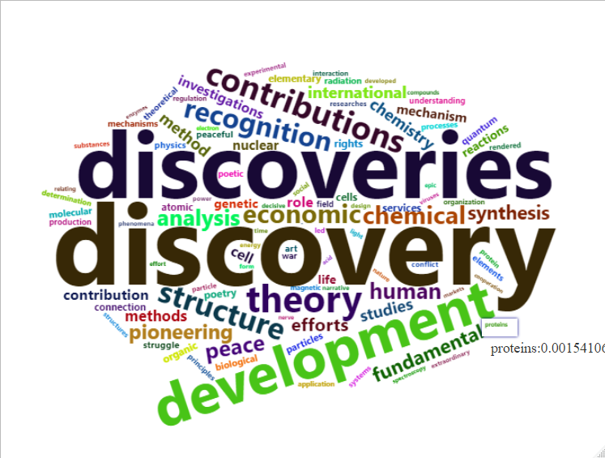

```{r setup, include=FALSE}
knitr::opts_chunk$set(tidy = "styler")
```
```{r eval=TRUE, echo=FALSE}
suppressPackageStartupMessages(library(tidyverse))
suppressPackageStartupMessages(library(stringr))
suppressPackageStartupMessages(library(httr))
suppressPackageStartupMessages(library(listviewer))
suppressPackageStartupMessages(library(jsonlite))
suppressPackageStartupMessages(library(wordcloud2))
``` 

## Exercise 1: Lööf vs Löfven

#### a)

Construct a table `tweets` that joins the two tables and contains a variable `Person` identifying whether the observation comes from the “Lööf” of “Löfven” table. Tweets common to both tables should not be included in the join.

***

```{r eval=TRUE, echo=TRUE}
tweets_raw <- load("../HW_data/LoofLofvenTweets.Rdata")
sentiment <- read_delim("https://svn.spraakdata.gu.se/sb-arkiv/pub/lmf/sentimentlex/sentimentlex.csv", delim = ",") %>%
    select(word, strength, confidence)

# add Person variable to both tibbles
Lofven$Person <- "Löfven"
Loof$Person <-  "Lööf"

all_tweets <- rbind(Lofven, Loof) # Merge tibbles vertically
tweets <- distinct(all_tweets, text, .keep_all = TRUE) # Remove duplicate sum(Lofven$text == Loof$text) = 902 tweets
knitr::kable(head(tweets))
```

#### b)

Illustrate how the intensity of tweets containing the word “statsminister” (or “Statsminister”) has evolved in time for
the `Person`:s using, e.g., histograms with time on the x-axis.

***

```{r eval=TRUE, echo=TRUE}
intensity <- tweets %>% # Captures tweets containing e.g. "statsministerkandidat" and "xyztatsminister"
  mutate(text = str_replace(text, "(.*tatsminister.*)", "This tweet used to contain the words tatsminister")) %>% 
  filter(text == "This tweet used to contain the words tatsminister")

ggplot(intensity) +
  geom_histogram(aes(x = created_at, color = Person)) +
  labs(
    x = "Time of Tweet",
    y = "Counts",
    title = "Histogram over the usage of the word s/Statsminister on Twitter"
  )

```

#### c)

Compute and plot the daily average sentiment of words in the tweet texts for the two Person:s. We define the average sentiment as the average strength of words common to the text and the sentiment lexicon at [https://svn.spraakdata.gu.se/sb-arkiv/pub/lmf/sentimentlex/sentimentlex.csv](https://svn.spraakdata.gu.se/sb-arkiv/pub/lmf/sentimentlex/sentimentlex.csv). Note that the function `separate_rows` can be useful in splitting the text into words.

***
```{r eval=TRUE, echo=TRUE}
tweets %>% 
  select(created_at, Person, text) %>%
  mutate(created_at = as.POSIXct(created_at) %>% lubridate::date()) %>% 
  separate_rows(text, sep = " ") %>% 
  inner_join(sentiment, by = c("text" = "word")) %>% 
  group_by(created_at, Person) %>% 
  summarize(
    weighted_avg_strength = mean(strength*confidence),
    avg_strength = mean(strength)
  ) %>% 
  ggplot(aes(x = created_at, y = avg_strength, color = Person)) + 
  geom_line(aes(y=avg_strength)) +
  geom_line(aes(y = weighted_avg_strength), linetype = "dashed") + 
  scale_color_manual(values=c("#e8112d", "#016A3A")) +
  labs(x = "Day of Tweet", y = "Sentiment Score", title = "Weighted (dashed) and unweighted average tweet sentiment for two politicians")
    

```

## Exercise 2: Nobel API

The [2019 Nobel lectures](https://www.nobelprize.org/ceremonies/nobel-week-2019/) start this week. The Nobel foundation even maintains an API to look up information about the Nobel Laureates. 

#### a) 

Fetch a list in JSON format with information on the Nobel prizes in Literature from [The Nobel Prize API](https://nobelprize.readme.io/).

***

```{r eval=TRUE, echo=TRUE}
schema_response <- GET("http://api.nobelprize.org/v1/prize.json")
schema_json <- content(schema_response, "text")
schema_df <- fromJSON(schema_json)$prizes
```

#### b) 

Extract all the prize motivations from the JSON-list, convert into a character vector of words, remove stop words and visualise the relative frequencies of remaining words in a word-cloud. R-packages for plotting word clouds include e.g. wordcloud, wordcloud2 and ggwordcloud and a list of stop words can be fetched by

```{r, message=FALSE}
stop_words_url <- "https://raw.githubusercontent.com/stopwords-iso/stopwords-en/master/stopwords-en.txt"
stopwords <- read_table(stop_words_url, col_names = "words")
```

***

```{r eval=TRUE, echo=TRUE, message=FALSE}
laureates <- unnest(schema_df, laureates) # unnest the df
knitr::kable(head(laureates))

motivation <- c(laureates$motivation)
stopwords <- read_table("https://raw.githubusercontent.com/stopwords-iso/stopwords-en/master/stopwords-en.txt", col_names = "words")

motivation_clean <- str_remove_all(motivation, "\"|,") %>% 
  str_split(" ") %>% 
  unlist(recursive = TRUE) %>% # separate motivations into words
  as.data.frame() %>% 
  anti_join(stopwords, by = c("." = "words")) %>% #remove stop words
  group_by_all() %>% # group identical words
  count() # count number of groupings made per word
  
motivation_clean$n <- prop.table(motivation_clean$n) # make relative proportion

sorted_words <- motivation_clean %>% 
  arrange(desc(n)) %>%  # order by most common
  head(100) # save top 100 words

#wordcloud2(sorted_words, size = 0.7)

```

