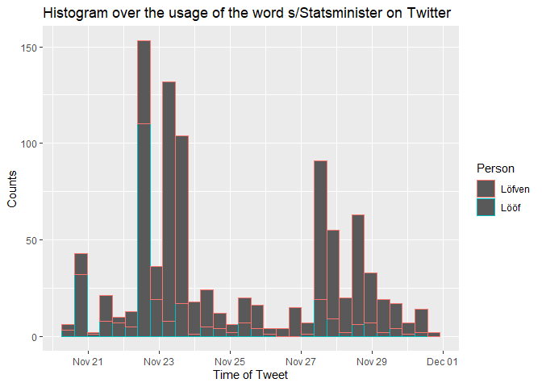
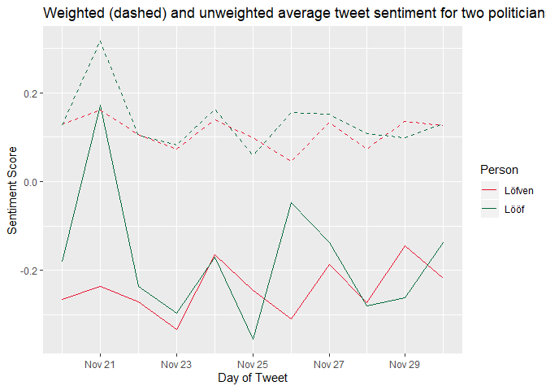

HW5: Nobel tweets
================

## Exercise 1: Lööf vs Löfven

#### a)

Construct a table `tweets` that joins the two tables and contains a
variable `Person` identifying whether the observation comes from the
“Lööf” of “Löfven” table. Tweets common to both tables should not be
included in the join.

-----

``` r
tweets_raw <- load("../HW_data/LoofLofvenTweets.Rdata")
sentiment <- read_delim("https://svn.spraakdata.gu.se/sb-arkiv/pub/lmf/sentimentlex/sentimentlex.csv", delim = ",") %>%
  select(word, strength, confidence)
```

    ## Parsed with column specification:
    ## cols(
    ##   word = col_character(),
    ##   polarity = col_character(),
    ##   strength = col_double(),
    ##   sense = col_character(),
    ##   written_form = col_character(),
    ##   part_of_speech = col_character(),
    ##   confidence = col_double(),
    ##   lemgram = col_character(),
    ##   lemgram_frequency = col_double(),
    ##   lemma_frequency = col_character(),
    ##   example = col_character()
    ## )

    ## Warning: 1 parsing failure.
    ## row col   expected     actual                                                                          file
    ## 172  -- 11 columns 21 columns 'https://svn.spraakdata.gu.se/sb-arkiv/pub/lmf/sentimentlex/sentimentlex.csv'

``` r
# add Person variable to both tibbles
Lofven$Person <- "Löfven"
Loof$Person <- "Lööf"

all_tweets <- rbind(Lofven, Loof) # Merge tibbles vertically
tweets <- distinct(all_tweets, text, .keep_all = TRUE) # Remove duplicate sum(Lofven$text == Loof$text) = 902 tweets
knitr::kable(head(tweets))
```

| user\_id    | status\_id             | created\_at     | screen\_name    | text                                                                                                                                                                                                                                                                                                    | source             | display\_text\_width | reply\_to\_status\_id | reply\_to\_user\_id | reply\_to\_screen\_name | is\_quote | is\_retweet     |  favorite\_count |   retweet\_count | hashtags    | symbols    | urls\_url                      | urls\_t.co                | urls\_expanded\_url                                             | media\_url | media\_t.co | media\_expanded\_url | media\_type | ext\_media\_url | ext\_media\_t.co | ext\_media\_expanded\_url | ext\_media\_type  | mentions\_user\_id   | mentions\_screen\_name  | lang   | quoted\_status\_id     | quoted\_text                                                                                                                                                                                                                                                                                          | quoted\_created\_at | quoted\_source        | quoted\_favorite\_count | quoted\_retweet\_count | quoted\_user\_id | quoted\_screen\_name | quoted\_name           |  quoted\_followers\_count |  quoted\_friends\_count |  quoted\_statuses\_count | quoted\_location         | quoted\_description                                                                                                                                       | quoted\_verified | retweet\_status\_id | retweet\_text | retweet\_created\_at | retweet\_source | retweet\_favorite\_count | retweet\_retweet\_count | retweet\_user\_id | retweet\_screen\_name | retweet\_name | retweet\_followers\_count | retweet\_friends\_count | retweet\_statuses\_count | retweet\_location | retweet\_description | retweet\_verified | place\_url | place\_name  | place\_full\_name | place\_type   | country    | country\_code   | geo\_coords   | coords\_coords | bbox\_coords                      | status\_url                                              | name | location | description                  | url  | protected  | followers\_count | friends\_count | listed\_count | statuses\_count | favourites\_count | account\_created\_at | verified    | profile\_url   | profile\_expanded\_url  | account\_lang   | profile\_banner\_url   | profile\_background\_url                           | profile\_image\_url                                                           | Person |
| :---------- | :--------------------- | :-------------- | :-------------- | :------------------------------------------------------------------------------------------------------------------------------------------------------------------------------------------------------------------------------------------------------------------------------------------------------ | :----------------- | -------------------: | :-------------------- | :------------------ | :---------------------- | :-------- | :-------------- | ---------------: | ---------------: | :---------- | :--------- | :----------------------------- | :------------------------ | :-------------------------------------------------------------- | :--------- | :---------- | :------------------- | :---------- | :-------------- | :--------------- | :------------------------ | :---------------- | :------------------- | :---------------------- | :----- | :--------------------- | :---------------------------------------------------------------------------------------------------------------------------------------------------------------------------------------------------------------------------------------------------------------------------------------------------- | :------------------ | :-------------------- | ----------------------: | ---------------------: | :--------------- | :------------------- | :--------------------- | ------------------------: | ----------------------: | -----------------------: | :----------------------- | :-------------------------------------------------------------------------------------------------------------------------------------------------------- | :--------------- | :------------------ | :------------ | :------------------- | :-------------- | -----------------------: | ----------------------: | :---------------- | :-------------------- | :------------ | ------------------------: | ----------------------: | -----------------------: | :---------------- | :------------------- | :---------------- | :--------- | :----------- | :---------------- | :------------ | :--------- | :-------------- | :------------ | :------------- | :-------------------------------- | :------------------------------------------------------- | :--- | :------- | :--------------------------- | :--- | :--------- | ---------------: | -------------: | ------------: | --------------: | ----------------: | :------------------- | :---------- | :------------- | :---------------------- | :-------------- | :--------------------- | :------------------------------------------------- | :---------------------------------------------------------------------------- | :----- |
| 85139778    | 1068518119306481664    | 1543589546      | roffehe         | Jag trodde inte de skulle förhandla utan att C + L skulle invänta svar från Löfven och därefter ta ställning till svaret. <https://t.co/CaUIShi9hW>                                                                                                                                                     | Twitter Web Client |                  121 | NA                    | NA                  | NA                      | TRUE      | FALSE           |                1 |                0 | NA          | NA         | twitter.com/KristerThelin/…    | <https://t.co/CaUIShi9hW> | <https://twitter.com/KristerThelin/status/1068503914402717696>  | NA         | NA          | NA                   | NA          | NA              | NA               | NA                        | NA                | NA                   | NA                      | sv     | 1068503914402717696    | Förhandlar Löfven med @annieloof och @bjorklundjan var för sig eller i klump?                                                                                                                                                                                                                         | 1543586159          | Twitter Web Client    |                       7 |                      3 | 18577082         | KristerThelin        | Krister Thelin         |                     10146 |                    1316 |                    69264 | Antibes, France          | Judge (ret.), Swedish citizen and French resident. Liberal in some, conservative in some.                                                                 | FALSE            | NA                  | NA            | NA                   | NA              |                       NA |                      NA | NA                | NA                    | NA            |                        NA |                      NA |                       NA | NA                | NA                   | NA                | NA         | NA           | NA                | NA            | NA         | NA              | c(NA, NA)     | c(NA, NA)      | c(NA, NA, NA, NA, NA, NA, NA, NA) | <https://twitter.com/roffehe/status/1068518119306481664> | Rolf |          | Independent creative thinker | NA   | FALSE      |              181 |            931 |             1 |            5521 |             57988 | 1256496502           | FALSE       | NA             | NA                      | en              | NA                     | <http://abs.twimg.com/images/themes/theme1/bg.png> | <http://pbs.twimg.com/profile_images/566906370553692160/wltK-kaf_normal.jpeg> | Löfven |
| 85139778    | 1066109530268942343    | 1543015294      | roffehe         | Varför får Löfven 11/2 vecka på sig?                                                                                                                                                                                                                                                                    |                    |                      |                       |                     |                         |           |                 |                  |                  |             |            |                                |                           |                                                                 |            |             |                      |             |                 |                  |                           |                   |                      |                         |        |                        |                                                                                                                                                                                                                                                                                                       |                     |                       |                         |                        |                  |                      |                        |                           |                         |                          |                          |                                                                                                                                                           |                  |                     |               |                      |                 |                          |                         |                   |                       |               |                           |                         |                          |                   |                      |                   |            |              |                   |               |            |                 |               |                |                                   |                                                          |      |          |                              |      |            |                  |                |               |                 |                   |                      |             |                |                         |                 |                        |                                                    |                                                                               |        |
| Det borde v | äl räcka med 1/2 vecka | . <https://t.c> | o/bq5gHzjU04    | Twitter Web Client 71 NA NA NA                                                                                                                                                                                                                                                                          | TRUE               |                FALSE | 1                     | 0 NA NA             | twitter.com/katjano     | uch/sta…  | <https://t.co/> |  bq5gHzjU04 http | s://twitter.com/ | katjanouch/ | status/106 | 6023611251810304 NA            | NA NA                     | NA NA NA NA                                                     |            | NA          | NA                   | N           | A               | sv 1066          | 023611251810304 Om Löfv   | en ska bli statsm | inister igen kan man | ju undra varför vi haft | val öv | erhuvudtaget? Socialis | tisk enpartistat nästa… \#svpol <https://t.co/oVvrq2H4iY> 1542994809 Twitter for iPhone 727 156 297838327                                                                                                                                                                                             | katjanouch          | Katerina Jan          |            ouch🔫 🇸🇪🇨🇿🔯🐘 |                  45029 | 2176             | 69381                | Prague, Czech Republic | Författare, expert, swish | journalist 0733289122 h | ttps://t.co/MKPQLqkgJF i | <nfo@katerinamagasin.se> | Instagram: @katjanouch FALSE NA NA NA NA                                                                                                                  | NA               |                     | NA NA         | NA                   | NA              |                          |                      NA | NA                | NA NA                 | NA            |                        NA |                      NA |                    NA NA | NA                | NA NA                | c(NA, NA) c(N     | A, NA)     | c(NA, NA, NA | , NA, NA, NA, NA, | NA) <https:/> | /twitter.c | om/roffehe/stat | us/1066109530 | 268942343 Rolf | Independent creative t            | hinker NA FALSE 181 9                                    | 31   | 1        | 5521 5                       | 7988 | 1256496502 |            FALSE |             NA |            NA |              en |                NA | <http://abs.tw>      | img.com/ima | ges/themes/the | me1/bg.png <http://pbs> | .twimg.com/prof | ile\_images/5669063705 | 53692160/wltK-kaf\_normal.jpeg Löfven              |                                                                               |        |
| 85139778    | 1067885801198010369    | 1543438790      | roffehe         | Jag gissar att Löfven anser att det är bättre att han själv bedriver allianspolitik än överlåter det till någon annan. Därför var det dumt att överhuvudtaget öppna dörren på glänt för s. <https://t.co/pktSgyVZA9>                                                                                    | Twitter Web Client |                  186 | NA                    | NA                  | NA                      | TRUE      | FALSE           |                1 |                0 | NA          | NA         | twitter.com/RichardHerrey/…    | <https://t.co/pktSgyVZA9> | <https://twitter.com/RichardHerrey/status/1067796942334427136>  | NA         | NA          | NA                   | NA          | NA              | NA               | NA                        | NA                | NA                   | NA                      | sv     | 1067796942334427136    | Det känns ärligt talat som en scen ur ”Life if Brian” med                                                                                                                                                                                                                                             |                     |                       |                         |                        |                  |                      |                        |                           |                         |                          |                          |                                                                                                                                                           |                  |                     |               |                      |                 |                          |                         |                   |                       |               |                           |                         |                          |                   |                      |                   |            |              |                   |               |            |                 |               |                |                                   |                                                          |      |          |                              |      |            |                  |                |               |                 |                   |                      |             |                |                         |                 |                        |                                                    |                                                                               |        |
| Monty Pytho | n.                     |                 |                 |                                                                                                                                                                                                                                                                                                         |                    |                      |                       |                     |                         |           |                 |                  |                  |             |            |                                |                           |                                                                 |            |             |                      |             |                 |                  |                           |                   |                      |                         |        |                        |                                                                                                                                                                                                                                                                                                       |                     |                       |                         |                        |                  |                      |                        |                           |                         |                          |                          |                                                                                                                                                           |                  |                     |               |                      |                 |                          |                         |                   |                       |               |                           |                         |                          |                   |                      |                   |            |              |                   |               |            |                 |               |                |                                   |                                                          |      |          |                              |      |            |                  |                |               |                 |                   |                      |             |                |                         |                 |                        |                                                    |                                                                               |        |
| Thomas Gür  | beskriver Annie Lööfs  | resonemang ne   | dan. \#svpol ht | tps://t.co/oDx7izhbZ5 1543417604 Twitter for iPhone 451 131 35209318 RichardHerrey Richard Her                                                                                                                                                                                                          | rey                |                25037 | 3695                  | 8436                | 8 Sweden                | Lyckof    | igur - A luck   | y Father Husband | Grandpa Singer C | omposer Rad | iohost Har | dRockGeneralManager..and yes - | Eurovision winner from th | e vinyl age FALSE NA                                            | NA         | NA          | NA                   |             |                 | NA               | NA NA                     | NA                | NA                   |                         | NA     | NA                     | NA NA NA NA NA NA NA NA NA NA c(NA, NA) c(NA, NA) c(NA, NA, NA, NA, NA, NA, NA, NA) <https://twitter.com/roffehe/status/1067885801198010369> Rolf                                                                                                                                                     | Indepen             | dent creative thinker |                NA FALSE |                    181 | 931              | 1 5521               | 57988 125649           |                6502 FALSE |                   NA NA |                       en | NA                       | <http://abs.twimg.com/images/themes/theme1/bg.png> <http://pbs.twimg.com/profile_images/566906370553692160/wltK-kaf_normal.jpeg> Löfven                   |                  |                     |               |                      |                 |                          |                         |                   |                       |               |                           |                         |                          |                   |                      |                   |            |              |                   |               |            |                 |               |                |                                   |                                                          |      |          |                              |      |            |                  |                |               |                 |                   |                      |             |                |                         |                 |                        |                                                    |                                                                               |        |
| 85139778    | 1067512209754988545    | 1543349718      | roffehe         | @annieloof Bryter Löfven mot en överenskommelse kan du ju genomdriva en misstroendeomröstning.                                                                                                                                                                                                          | Twitter Web Client |                   83 | 1067487281349570561   | 18447095            | annieloof               | FALSE     | FALSE           |                1 |                0 | NA          | NA         | NA                             | NA                        | NA                                                              | NA         | NA          | NA                   | NA          | NA              | NA               | NA                        | NA                | 18447095             | annieloof               | sv     | NA                     | NA                                                                                                                                                                                                                                                                                                    | NA                  | NA                    |                      NA |                     NA | NA               | NA                   | NA                     |                        NA |                      NA |                       NA | NA                       | NA                                                                                                                                                        | NA               | NA                  | NA            | NA                   | NA              |                       NA |                      NA | NA                | NA                    | NA            |                        NA |                      NA |                       NA | NA                | NA                   | NA                | NA         | NA           | NA                | NA            | NA         | NA              | c(NA, NA)     | c(NA, NA)      | c(NA, NA, NA, NA, NA, NA, NA, NA) | <https://twitter.com/roffehe/status/1067512209754988545> | Rolf |          | Independent creative thinker | NA   | FALSE      |              181 |            931 |             1 |            5521 |             57988 | 1256496502           | FALSE       | NA             | NA                      | en              | NA                     | <http://abs.twimg.com/images/themes/theme1/bg.png> | <http://pbs.twimg.com/profile_images/566906370553692160/wltK-kaf_normal.jpeg> | Löfven |
| 85139778    | 1067885108479315968    | 1543438624      | roffehe         | Löfven kanske ser det som om han accepterar centerns lista får han leda den politik som specificeras medan om han avstår kommer någon annan att leda den specificerade politiken. Listan är troligen av underordnad betydelse för s, statsministerposten är viktigast. <https://t.co/yow8z6YlAv>        | Twitter Web Client |                  262 | NA                    | NA                  | NA                      | TRUE      | FALSE           |                1 |                0 | NA          | NA         | twitter.com/bjornhakansson…    | <https://t.co/yow8z6YlAv> | <https://twitter.com/bjornhakansson/status/1067558029825110016> | NA         | NA          | NA                   | NA          | NA              | NA               | NA                        | NA                | NA                   | NA                      | sv     | 1067558029825110016    | Det vore ju fantastiskt om S gick med på Centerns kravlista. Det skulle ju innebära att det inte bara fanns en 59-procentig icke-socialistisk majoritet i Riksdagen, utan en 87-procentig. Kanske det till slut går att hitta en majoritet för att bilda en regering också? <https://t.co/EoJniQnbkN> | 1543360643          | Twitter for iPhone    |                      44 |                     13 | 900114385        | bjornhakansson       | Björn Håkansson        |                      2186 |                     547 |                    25929 | Haag, Nederländerna      | Svensk i Nederländerna, med hustru och tonårsdotter. Civilingenjör. Ateist och yttrandefrihetsfundamentalist. Liberalkonservativ sedan Gösta Bohmans tid. | FALSE            | NA                  | NA            | NA                   | NA              |                       NA |                      NA | NA                | NA                    | NA            |                        NA |                      NA |                       NA | NA                | NA                   | NA                | NA         | NA           | NA                | NA            | NA         | NA              | c(NA, NA)     | c(NA, NA)      | c(NA, NA, NA, NA, NA, NA, NA, NA) | <https://twitter.com/roffehe/status/1067885108479315968> | Rolf |          | Independent creative thinker | NA   | FALSE      |              181 |            931 |             1 |            5521 |             57988 | 1256496502           | FALSE       | NA             | NA                      | en              | NA                     | <http://abs.twimg.com/images/themes/theme1/bg.png> | <http://pbs.twimg.com/profile_images/566906370553692160/wltK-kaf_normal.jpeg> | Löfven |
| 85139778    | 1067829917159747584    | 1543425466      | roffehe         | @AnnHHeberlein Valet borde vara ganska enkelt för Löfven. Han har att välja på att vara statsminister eller att inte vara statsministern Så som kraven är ställda blir delar av politiken desamma oberoende av Löfvens val och för Löfven återstår att besluta om han skall sitta vid rodret eller inte | Twitter Web Client |                  280 | 1067805565018128384   | 781835440840183808  | AnnHHeberlein           | FALSE     | FALSE           |                1 |                0 | NA          | NA         | NA                             | NA                        | NA                                                              | NA         | NA          | NA                   | NA          | NA              | NA               | NA                        | NA                | 781835440840183808   | AnnHHeberlein           | sv     | NA                     | NA                                                                                                                                                                                                                                                                                                    | NA                  | NA                    |                      NA |                     NA | NA               | NA                   | NA                     |                        NA |                      NA |                       NA | NA                       | NA                                                                                                                                                        | NA               | NA                  | NA            | NA                   | NA              |                       NA |                      NA | NA                | NA                    | NA            |                        NA |                      NA |                       NA | NA                | NA                   | NA                | NA         | NA           | NA                | NA            | NA         | NA              | c(NA, NA)     | c(NA, NA)      | c(NA, NA, NA, NA, NA, NA, NA, NA) | <https://twitter.com/roffehe/status/1067829917159747584> | Rolf |          | Independent creative thinker | NA   | FALSE      |              181 |            931 |             1 |            5521 |             57988 | 1256496502           | FALSE       | NA             | NA                      | en              | NA                     | <http://abs.twimg.com/images/themes/theme1/bg.png> | <http://pbs.twimg.com/profile_images/566906370553692160/wltK-kaf_normal.jpeg> | Löfven |

#### b)

Illustrate how the intensity of tweets containing the word
“statsminister” (or “Statsminister”) has evolved in time for the
`Person`:s using, e.g., histograms with time on the x-axis.

-----

``` r
intensity <- tweets %>% # Captures tweets containing e.g. "statsministerkandidat" and "xyztatsminister"
  mutate(text = str_replace(text, "(.*tatsminister.*)", "This tweet used to contain the words tatsminister")) %>%
  filter(text == "This tweet used to contain the words tatsminister")

ggplot(intensity) +
  geom_histogram(aes(x = created_at, color = Person)) +
  labs(
    x = "Time of Tweet",
    y = "Counts",
    title = "Histogram over the usage of the word s/Statsminister on Twitter"
  )
```

    ## `stat_bin()` using `bins = 30`. Pick better value with `binwidth`.

<!-- -->

#### c)

Compute and plot the daily average sentiment of words in the tweet texts
for the two Person:s. We define the average sentiment as the average
strength of words common to the text and the sentiment lexicon at
<https://svn.spraakdata.gu.se/sb-arkiv/pub/lmf/sentimentlex/sentimentlex.csv>.
Note that the function `separate_rows` can be useful in splitting the
text into words.

-----

``` r
tweets %>%
  select(created_at, Person, text) %>%
  mutate(created_at = as.POSIXct(created_at) %>% lubridate::date()) %>%
  separate_rows(text, sep = " ") %>%
  inner_join(sentiment, by = c("text" = "word")) %>%
  group_by(created_at, Person) %>%
  summarize(
    weighted_avg_strength = mean(strength * confidence),
    avg_strength = mean(strength)
  ) %>%
  ggplot(aes(x = created_at, y = avg_strength, color = Person)) +
  geom_line(aes(y = avg_strength)) +
  geom_line(aes(y = weighted_avg_strength), linetype = "dashed") +
  scale_color_manual(values = c("#e8112d", "#016A3A")) +
  labs(x = "Day of Tweet", y = "Sentiment Score", title = "Weighted (dashed) and unweighted average tweet sentiment for two politicians")
```

<!-- -->

## Exercise 2: Nobel API

The [2019 Nobel
lectures](https://www.nobelprize.org/ceremonies/nobel-week-2019/) start
this week. The Nobel foundation even maintains an API to look up
information about the Nobel Laureates.

#### a)

Fetch a list in JSON format with information on the Nobel prizes in
Literature from [The Nobel Prize API](https://nobelprize.readme.io/).

-----

``` r
schema_response <- GET("http://api.nobelprize.org/v1/prize.json")
schema_json <- content(schema_response, "text")
schema_df <- fromJSON(schema_json)$prizes
```

#### b)

Extract all the prize motivations from the JSON-list, convert into a
character vector of words, remove stop words and visualise the relative
frequencies of remaining words in a word-cloud. R-packages for plotting
word clouds include e.g. wordcloud, wordcloud2 and ggwordcloud and a
list of stop words can be fetched by

``` r
stop_words_url <- "https://raw.githubusercontent.com/stopwords-iso/stopwords-en/master/stopwords-en.txt"
stopwords <- read_table(stop_words_url, col_names = "words")
```

-----

``` r
laureates <- unnest(schema_df, laureates) # unnest the df
knitr::kable(head(laureates))
```

| year | category  | id  | firstname  | surname     | motivation                                                      | share | overallMotivation |
| :--- | :-------- | :-- | :--------- | :---------- | :-------------------------------------------------------------- | :---- | :---------------- |
| 2019 | chemistry | 976 | John       | Goodenough  | “for the development of lithium-ion batteries”                  | 3     | NA                |
| 2019 | chemistry | 977 | M. Stanley | Whittingham | “for the development of lithium-ion batteries”                  | 3     | NA                |
| 2019 | chemistry | 978 | Akira      | Yoshino     | “for the development of lithium-ion batteries”                  | 3     | NA                |
| 2019 | economics | 982 | Abhijit    | Banerjee    | “for their experimental approach to alleviating global poverty” | 3     | NA                |
| 2019 | economics | 983 | Esther     | Duflo       | “for their experimental approach to alleviating global poverty” | 3     | NA                |
| 2019 | economics | 984 | Michael    | Kremer      | “for their experimental approach to alleviating global poverty” | 3     | NA                |

``` r
motivation <- c(laureates$motivation)
stopwords <- read_table("https://raw.githubusercontent.com/stopwords-iso/stopwords-en/master/stopwords-en.txt", col_names = "words")

motivation_clean <- str_remove_all(motivation, "\"|,") %>%
  str_split(" ") %>%
  unlist(recursive = TRUE) %>% # separate motivations into words
  as.data.frame() %>%
  anti_join(stopwords, by = c("." = "words")) %>% # remove stop words
  group_by_all() %>% # group identical words
  count() # count number of groupings made per word
```

    ## Warning: Column `.`/`words` joining factor and character vector, coercing into
    ## character vector

``` r
motivation_clean$n <- prop.table(motivation_clean$n) # make relative proportion

sorted_words <- motivation_clean %>%
  arrange(desc(n)) %>% # order by most common
  head(100) # save top 100 words

# wordcloud2(sorted_words, size = 0.7)
knitr::include_graphics("wordcloud.png")
```

<!-- -->
