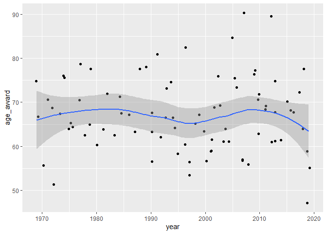

HW6: Nobel prize winning project
================

# Exercise 1: Purrr

##### a. Use the API to extract the id of all Nobel laureates in economics from 1969 to 2019. Use purrr functionality to create a data.frame laureates containing five columns: year, category (always economics), firstname, surname and id. Note: It might be worthwhile to cache the result of your query using cache=TRUE in the code chunk of the knitr document in order to avoid calling the API whenever you compile your document.

``` r
econ_laureates <- function() {
  nobel_json <- GET("http://api.nobelprize.org/v1/prize.json") %>%
    content("text")

  nobel_laureates <- fromJSON(nobel_json)$prizes %>%
    filter(category == "economics") %>%
    unnest(laureates) %>%
    select(-motivation, -share, -overallMotivation)
}
laureates <- econ_laureates()
knitr::kable(head(laureates))
```

| year | category  | id  | firstname  | surname  |
| :--- | :-------- | :-- | :--------- | :------- |
| 2019 | economics | 982 | Abhijit    | Banerjee |
| 2019 | economics | 983 | Esther     | Duflo    |
| 2019 | economics | 984 | Michael    | Kremer   |
| 2018 | economics | 968 | William D. | Nordhaus |
| 2018 | economics | 969 | Paul M.    | Romer    |
| 2017 | economics | 949 | Richard H. | Thaler   |

-----

##### b. Use the API and purrr functionality to loop over all the above ids in laureates. For each id determine the day of birth and the gender of the Laureate in economics. Add these as columns day\_of\_birth and gender to the above laureates frame and store the result in a data.frame denoted laureates\_info. Note: It might be worthwhile to cache the result of your query using cache=TRUE in the code chunk of the knitr document in order to avoid calling the API whenever you compile your document.

``` r
get_date <- function(laureate_id) {
  nobel_json <- GET("http://api.nobelprize.org/v1/laureate.json",
    query = list(id = laureate_id)
  ) %>% # Pass the input id as a query
    content("text")

  date <- fromJSON(nobel_json)$laureates$born
  date_clean <- str_replace_all(date, "(00)", "01") # Replace faulty (possibly unknown?) birth dates.
}

get_gender <- function(laureate_id) {
  nobel_json <- GET("http://api.nobelprize.org/v1/laureate.json",
    query = list(id = laureate_id)
  ) %>% # Pass the input id as a query
    content("text")

  gender <- fromJSON(nobel_json)$laureates$gender
}

info_df <- data.frame( # Preallocate dataframe for speed
  "day_of_birth" = character(length(laureates$id)),
  "gender" = character(length(laureates$id)),
  stringsAsFactors = FALSE
)

info_df$gender <- map_chr(laureates$id, get_gender) # Populate df by filling column with result of get_gender
info_df$day_of_birth <- map_chr(laureates$id, get_date) # Populate df by filling column with result of get_day_of_birth

laureates_info <- bind_cols(laureates, info_df) %>%
  mutate(day_of_birth = lubridate::ymd(day_of_birth)) # convert to date type using lubridate

knitr::kable(head(laureates_info))
```

| year | category  | id  | firstname  | surname  | day\_of\_birth | gender |
| :--- | :-------- | :-- | :--------- | :------- | :------------- | :----- |
| 2019 | economics | 982 | Abhijit    | Banerjee | 1961-02-21     | male   |
| 2019 | economics | 983 | Esther     | Duflo    | 1972-10-25     | female |
| 2019 | economics | 984 | Michael    | Kremer   | 1964-11-12     | male   |
| 2018 | economics | 968 | William D. | Nordhaus | 1941-05-31     | male   |
| 2018 | economics | 969 | Paul M.    | Romer    | 1955-01-01     | male   |
| 2017 | economics | 949 | Richard H. | Thaler   | 1945-09-12     | male   |

-----

##### c. What is the proportion of female laureates among all current laureates in economics?

``` r
count_genders <- laureates_info %>%
  group_by(gender) %>%
  summarize(
    count = n()
  )
ans <- as.numeric(count_genders[1, 2] / (count_genders[1, 2] + count_genders[2, 2]))
knitr::kable(count_genders)
```

| gender | count |
| :----- | ----: |
| female |     2 |
| male   |    82 |

The proportion of females is then 2.4%

-----

##### d. Assuming that the award is given on the 1st of December every year it is given, compute the age (in years) at the time of the award for each laureate and add this to the laureates\_info frame. Illustrate this age as a function of the award year for the laureates. Also add an appropriate smooth function using geom\_smooth. Interpret the overall result, i.e. how has age at the time of the award evolved with time.

``` r
laureates_info <- laureates_info %>%
  mutate(year_prize = paste0(year, "-12-01") %>% # Add temporary variable for time of prize ceremony
    lubridate::ymd()) %>%
  mutate(age_award = lubridate::time_length( # difference in years using lubridate
    difftime(year_prize, day_of_birth),
    "years"
  )) %>%
  mutate(year = as.numeric(year)) %>%
  select(-year_prize) # remove temp variable
knitr::kable(head(laureates_info))
```

| year | category  | id  | firstname  | surname  | day\_of\_birth | gender | age\_award |
| ---: | :-------- | :-- | :--------- | :------- | :------------- | :----- | ---------: |
| 2019 | economics | 982 | Abhijit    | Banerjee | 1961-02-21     | male   |   58.81370 |
| 2019 | economics | 983 | Esther     | Duflo    | 1972-10-25     | female |   47.13151 |
| 2019 | economics | 984 | Michael    | Kremer   | 1964-11-12     | male   |   55.08767 |
| 2018 | economics | 968 | William D. | Nordhaus | 1941-05-31     | male   |   77.55616 |
| 2018 | economics | 969 | Paul M.    | Romer    | 1955-01-01     | male   |   63.95890 |
| 2017 | economics | 949 | Richard H. | Thaler   | 1945-09-12     | male   |   72.26849 |

``` r
ggplot(laureates_info, aes(year, age_award)) +
  geom_jitter() +
  geom_smooth()
```

    ## `geom_smooth()` using method = 'loess' and formula 'y ~ x'

<!-- -->

No clear trend can be seen, except that the fitted curve seems to
oscillate somewhat from 65 years to high 60’s.

-----

# Exercise 2: Starting your project

##### a. State a catchy title for your project.

Can knowledge be bought?

How the Swedish grades are affected by municipal spending.

-----

##### b. Provide a short text (\~200-300 words) about the story you want to write. Include a specification of your intended readership for the blog-post (i.e. the report).

I want to investigate what measure affects the grades of 9:th graders,
more specifically the municipality’s education budget, PISA results, or
the number of teachers per student.

The underlying story will be the recent debate in Swedish media
regarding declining PISA results, school privatization, and
re-nationalization of the elementary school system. Is the municipality
competent enough to correctly and effectively allocate resources to the
educational system, and does this spending correlate with higher grades?

The intended reader is anyone who is interested in the Swedish
educational system and what measures can be taken to improve the
results.

As usual in an income statement, one of the big items are going to be
employment costs. Thus, I expect municiplaities with high educational
spending to correlate with a high number of teachers per student.
However, we should be able to see some variations due to the high number
of observations (290 municipalities).

This aspect is also going to be an interesting talking point, as the
teacher’s salaries also have been an item of intense media debate in
recent years. In order to continously attract aspiring teachers to the
educational programmes we should be able to showcase competetive
salaries along with a good working environment, i.e. attentive students
who show an increase in their grades. If student grades are in chronic
decline, the teachers alone will not be as interested to perform the
Sisyphean work needed to revert the trend. Thus, municipal backing in
form of more teachers per student might mitigate the current situation.
Moreover, the teacher’s own grading will be compared to the “official”
PISA results to possibly investigate and maybe correct for any grade
inflation.

-----

##### c. Describe your data source in some detail, i.e. the format, the availability, the volume (e.g. how many rows, how many different tables) etc. The availability could, e.g., be an URL or who you have to contact to get the data Please also indicate, whether you already got the data or if you are still in the search process.

I’m going to query the
[Kolada](https://www.kolada.se/index.php?_p=index/API) API, which
contains a lot of different data for Swedish municipalities, as well as
inflation rates from the Swedish Central Bank. I could collect the PISA
results which are made avaiable using the package intsvy available from
[CRAN](https://cran.r-project.org/web/packages/intsvy/intsvy.pdf). I
might be able to scrape the PISA data myself if it is dirty, and clean
it. In any case, I’m going to make sure that at least one data source is
messy\!

There are 290 different municipalities in Sweden, so the tables will all
have 290 rows/observations. Each column/variable will represent some
measured value for a given year, i.e. the average grade or the
municipality’s education budget.

-----

##### d. State in 2-3 sentences what you currently experience as the greatest element of uncertainty in terms of what is expected of you for the project work?

That the results are indefinite, or that I can’t communicate them in an
interesting and correct way. The data is already pretty tidy, so I won’t
be able to showcase a lot of the wrangling solutions that I know.

-----

##### e. State in 2-3 sentences what you think will be your biggest technical challenge during the project work?

The PISA results are extremely comprehensive. I gather them using a 3rd
party package, that I don’t yet know how to use. The package might not
even be made for extracting exactly the data that I want from the PISA
studies.

-----
