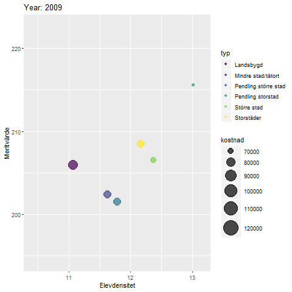
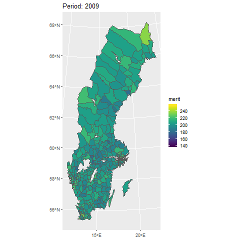

```{r,include=FALSE,echo=FALSE,message=FALSE, warning=FALSE }
options(knitr.table.format = "html")
options(digits = 2)
library(tidyverse)
library(sf)
library(httr)
library(jsonlite)
library(ggspatial)
library(readxl)
library(corrplot)
library(cluster)
library(gridExtra)
library(modelr)
library(kableExtra)
library(pxweb)
library(dendextend)
library(viridis)
library(gganimate)
```

# Introduktion
Mycket av den svenska skoldebatten har kretsat kring Sveriges fallande Pisa-resultat. Svenska elevers resultat har varit i en nedåtgående trend sen 2003 med ett trendbrott 2015, något som rapporterats av bland annat [Skolverket](https://www.skolverket.se/skolutveckling/forskning-och-utvarderingar/internationella-jamforande-studier-pa-utbildningsomradet/Pisa-internationell-studie-om-15-aringars-kunskaper-i-matematik-naturvetenskap-och-lasforstaelse) och [Aftonbladet](https://www.aftonbladet.se/nyheter/a/Op10OV/nytt-Pisa-resultat-fortsatt-uppat-for-svenska-elever). Pisa-resultaten används för att argumentera för sin skolpolitik, exempelvis för ett [förstatligande](https://www.dn.se/nyheter/politik/bjorklund-borgerlig-skolpolitik-har-haft-stor-betydelse/).
På grund av detta är det av intresse att utforska den nuvarande huvudmannens -- kommunernas -- prestanda i frågan. Hur höga meritpoäng renderar kommunens skolbudget i, och hur översätts sedan detta till Pisa-resultat? 

En annan variabel av intresse är vad vi kallar *elevdensiteten*, alltså antalet elever per lärare. Vi kan på så vis undersöka ifall en ökning av antalet lärare skulle kunna resultera i ökade skolresultat (alltså merit- och Pisa-poäng).

# Datainsamling
Från [Koladas](https://www.kolada.se/index.php?_p=index/API) API kan vi hämta finansiell data för kommunernas verksamheter. Vi vill dock arbeta med reala siffror, och behöver då inflationsdata från [SCB](https://www.scb.se/contentassets/2c6de261f74c4bd3bb237f63c3031df1/pr0101_2018a01_di_06-07_sv.xls). 

Då varje kommun står för kostnaden för skolskjuts, kommer rurala kommuner straffas jämfört med urbana då denna summa räknas med i den totala grundskolekostnaden och inte bidrar till kunskap per se. Således subtraherar vi kostnaden för skolskjuts från den totala kostnaden.
Kostnaderna för skolskjuts finns tyvärr bara för år 2013 och framåt hos Kolada. Efter vägledning av en handläggare på SCB hittades datan för år 2009 till 2012 i en av deras [databaser](http://www.statistikdatabasen.scb.se/pxweb/sv/ssd/START__OE__OE0107__OE0107G/FskolKlass/table/tableViewLayout1/), och vi kan således komplettera datan från Kolada med SCB via paketet [`pxweb`](https://cran.r-project.org/web/packages/pxweb/index.html). 

Från [Skolverket](https://www.skolverket.se/skolutveckling/statistik/sok-statistik-om-forskola-skola-och-vuxenutbildning?sok=SokD&niva=K&omr=grbetyg&exp=138&lasar=2009&uttag=null) finns meritvärdet för åk 9 per kommun och huvudman.

Från [SKR](https://skr.se/tjanster/kommunerlandsting/faktakommunerochlandsting/kommungruppsindelning.2051.html) hämtar vi klassificeringen av kommunerna. Här kan vi skilja på exempelvis storstäder, pendlingskommuner, och landsbygdskommuner.

Vi kan exportera Sveriges Pisa-resultat från Pisas [webbapp](https://pisadataexplorer.oecd.org/ide/idepisa/report.aspx?p=1-RMS-1-20183,20153,20123,20093-PVMATH-TOTAL-SWE-MN_MN-Y_J-0-0-37&Lang=1033).

Sammantaget får vi följande variabler för varje enskild kommun:

* Det genomsnittliga meritvärdet för årskurs 9 (Skolverket)
* Elever/lärare i grundskola (Kolada)
* Kostnad grundskola åk 1-9 (Kolada)
* Kostnad skolskjuts grundskola (Kolada + SCB)
* Inflation (SCB)
* Kommungruppsindelning (SKR)
* Pisa-resultat på nationell nivå (Pisa)


### Meritvärde
```{r,MERIT,echo=FALSE}
get_merit <- function(year){
  start_year <- sprintf("%02d", as.numeric(year)) # Add leading zero to single digit years.
  end_year <- as.numeric(year) + 1
  end_year <- sprintf("%02d", as.numeric(end_year)) # Add leading zero to single digit years.
  file <- paste0("../Data/exp_slutbetyg_kommun_20",start_year,"_",end_year,".csv")
  ifelse(as.numeric(end_year) > 15, skip_row <- 6, skip_row <- 5)
  slutbetyg <- read_csv2(file, skip = skip_row, col_names = TRUE)
  
  slutbetyg <- slutbetyg[,-length(slutbetyg)] %>% #Strip last empty column
    filter(`Typ av huvudman` == "Kommunal") %>% # Bara kommunala huvudmän
    select(2,9) %>% 
    mutate_all(funs(str_replace(.,",", "."))) 
  
  colnames(slutbetyg) <- c("municipality", "merit")
  slutbetyg$period = as.numeric(paste0("20",end_year))
  
  return(slutbetyg)
}

betyg <- map_df(8:17, function(year) {
  mat <- suppressWarnings({suppressMessages({get_merit(year)})})
})

betyg$merit <-
  if_else(betyg$period > 2014, 
          (16 / 17 * as.numeric(betyg$merit)),
          (as.numeric(betyg$merit))
  ) # Correct for grade reform in 2015

knitr::kable(sample_n(betyg,6)) %>% 
  kable_styling(bootstrap_options = "striped", full_width = F, position = "float_right")
```

I denna undersökning fokuserar vi enbart på det genomsnittliga meritvärdet per kommun för kommunala huvudmän. Således filtreras privata skolor bort. Detta på grund av att privata skolor kan vara nischade i större utsträckning är kommunala, se t.ex. [Internationella Engelska Skolan](https://engelska.se/) och [Waldorf](https://sv.wikipedia.org/wiki/Waldorfpedagogik).

Datan fås i csv-filer från [Skolverket](https://www.skolverket.se/skolutveckling/statistik/sok-statistik-om-forskola-skola-och-vuxenutbildning?sok=SokD&niva=K&omr=grbetyg&exp=138&lasar=2009&uttag=null).

Slutligen tvättas denna data genom att multiplicera varje kommuns elevantal med dess genomsnittliga meritvärde för kommunala skolor. Meritvärden mellan år 2009 och 2014 baseras på 16 ämnen, och värdet därefter på 17 ämnen. Vi korrigerar för detta genom att multiplicera meritvärden från 2015 och framåt med en faktor 16/17. Ett utdrag ur resultaten visas i tabellen till höger. 

### Inflation
Från Riksbanken kan vi ladda ner en Excelfil och läsa in den med `readxl`. 
```{r,INFL,echo=FALSE, results = FALSE}
inflation <- read_excel("../Data/pr0101_2018a01_di_06-07_sv.xls",
                        sheet = 3,
                        range = "A180:B197")
colnames(inflation) <- c("period","inflation")
```

```{r,SKR,echo=FALSE, warning = FALSE, message=FALSE}
kommundata <- read_csv2("../Data/Kommungruppsindelning_2017.csv") %>% 
  select(`Kommun namn`, Kommunkod, "Kommungrupp 2017 namn") %>% 
  rename(municipality = Kommunkod) %>% 
  rename(typ = "Kommungrupp 2017 namn") %>% 
  mutate(typ = replace(typ, typ %in% c("Pendlingskommun nära större stad","Lågpendlingskommun nära större stad"), "Pendling större stad")) %>% 
  mutate(typ = replace(typ, typ == "Pendlingskommun nära storstad", "Pendling storstad")) %>% 
  mutate(typ = replace(typ, typ %in% c("Landsbygdskommun","Landsbygdskommun med besöksnäring"), "Landsbygd")) %>%
  mutate(typ = replace(typ, typ %in% c("Pendlingskommun nära större stad","Lågpendlingskommun nära större stad"), "Pendling större stad")) %>% 
  mutate(typ = replace(typ, typ == "Pendlingskommun nära mindre stad/tätort", "Mindre stad/tätort"))
  

knitr::kable(sample_n(kommundata,6)) %>% 
  kable_styling(bootstrap_options = "striped", full_width = F, position = "float_right")
```
### Kommungruppsindelning
Från SKR får vi länken mellan kommunnamn/kod och kommungrupp. Ett utdrag ur datan visas till höger. 
<br><br><br><br><br><br><br><br><br><br>
  
  
### Pisa-resultat på nationell nivå
Från Pisa får vi Sveriges resultat för de tre ämnena som proven mäter: läsförmåga, matematik, och engelska. Återigen använder vi `readxl` för att läsa in Excelfilen, och `map_df()`för att iterera genom arken, då varje ämne har ett eget ark. Eftersom Pisaundersökningen bara görs vart tredje år interpolerar vi gapen linjärt med `approx()`. Resultatet visas i andra subfiguren i analysavsnittet nedan. 
```{r,PISA,echo=TRUE, results = FALSE}
pisa_result <- map_df(1:3, function(sheet_number) {
  test <- read_xls("../Data/IDEExcelExport-Jan072020-0427PM.xls",
                   sheet = sheet_number,
                   range = "B12:D16"
                   )
  }) %>% 
  group_by(`Year/Study`) %>% 
  summarize(
    pisa = mean(Average)
    )

interpolated_pisa <- data.frame(period = approx(x = pisa_result$`Year/Study`,
                                                y = pisa_result$pisa, n = 2018-2009+1)$x,
                                pisa = approx(x = pisa_result$`Year/Study`,
                                              y = pisa_result$pisa, n = 2018-2009+1)$y
                                )
```

### Kostnad per elev, grundskola 2009-2012

```{r,SCB,echo=FALSE, warning= FALSE, message = FALSE}
gammal_skolskjuts <- pxweb_get_data("http://api.scb.se/OV0104/v1/doris/sv/ssd/START/OE/OE0107/OE0107G/FskolKlass", 
                      list(ContentsCode = "OE0107A2", 
                           Region = "*", 
                           Nyckeltal = c("375","435","450"), 
                           Tid = c("2009","2010","2011","2012"))) %>%
  spread(key = uppgift, value = "Nyckeltal för kommunernas förskoleklass, grundskola och obl. särskola") %>% 
  rename("period" = år) %>% 
  left_join(kommundata, by = c("region" = "Kommun namn")) %>%
  mutate(kostnad = `grundskolan, kostnad totalt (tkr)` * 1000 /
          `grundskolan, genomsnittligt antal elever folkbokförda i kommunen` -
          `grundskolan, kostnad per elev för skolskjuts (kr)`
         ) %>% 
    select(municipality, period, kostnad) %>% 
  mutate(period = as.numeric(as.character(period)))
```
Från SCB får vi kostnad per elev för hela grundskolan genom att dividera grundskolekostnaden med det genomsnittliga antalet elever i kommunen och subtrahera kostnaden per elev för skolskjuts. 

### Kolada

```{r,KOLADA,echo=FALSE, warning = FALSE, message = FALSE}
get_kolada <- function(kpi, years){
  years_and_kpi <- expand.grid(kpi,years)
  urls <- paste0("https://api.kolada.se/v2/data/kpi/", years_and_kpi[[1]], "/year/", years_and_kpi[[2]])
  bruttokostnad <- data.frame("municipality" = as.character()
                              ,"kpi" = as.character()
                              ,"period" = as.character() 
                              ,"value" = as.character()
  )
  
  for (url in urls) {
    bruttokostnad_json <- GET(url) %>%
      content("text")
    
    if (!grepl("<",bruttokostnad_json)){ #If not bad requests (400)
      
      
      bruttokostnad_old <-  bruttokostnad
      if (length(bruttokostnad) != 0) { # 
        bruttokostnad <- head(fromJSON(bruttokostnad_json)$values, 290)
        bruttokostnad <- rbind(bruttokostnad,bruttokostnad_old)
      }}}
  return(unnest(bruttokostnad) %>% 
           filter(gender == "T") %>%  # both genders
           select(-count,-gender,-status))}

kpi <-  c("N15006","N15033","U15015")
years <- seq(2009,2018)

kolada <- get_kolada(kpi,years) %>% 
  spread(key = kpi, value = value) %>% 
  rename(elevdensitet = N15033) %>% 
  rename(kostnad = N15006) %>% 
  rename(skolskjuts = U15015) %>%
  mutate(kostnad = as.numeric(kostnad) - as.numeric(skolskjuts)) %>% 
  select(-skolskjuts)
```

Denna data fås direkt från Koladas API i json-format. API:t tillåter flera KPI-queries samtidigt, och vi kan då alltså direkt hämta elevdensitet, kostnad för grundskolan 2013-2019, och kostnad för skolskjuts 2013-2019.  
  
### Slutgiltig tabell

Nu sammanflätar vi all data med hjälp av kommunernas unika [kommunkoder](https://www.scb.se/hitta-statistik/regional-statistik-och-kartor/regionala-indelningar/lan-och-kommuner/lan-och-kommuner-i-kodnummerordning/), och Pisaresultaten med år. Notera att eftersom Pisaresultaten mäts på nationell nivå har varje kommun samma Pisaresultat för ett givet år. Vi delar även kostnaden med 1000 för att få kostnaden i tkr. Resultatet med avrundade siffror visas nedan.

```{r,DATA,echo=FALSE, message = FALSE, warning = FALSE}

data <- kolada %>% 
  left_join(gammal_skolskjuts, by = c("period","municipality")) %>%
  left_join(betyg, by = c("period","municipality")) %>%
  mutate(kostnad = coalesce(kostnad.x,kostnad.y) / 1000) %>% 
  select(-kostnad.x,-kostnad.y) %>% #Skräp från sammanslagningen
  left_join(interpolated_pisa, by = "period") %>% # Joina Pisa
  left_join(kommundata, by = "municipality") %>% #Joina kommuntyper
  left_join(inflation, by = "period") %>%  #Joina inflationsdata
  mutate(kostnad = kostnad * (100 + inflation) / 100.0) %>% #Inflationsjustering
  select(-inflation) %>% #Bort med inflation
  mutate(merit = as.numeric(merit)) %>% 
  na.omit

knitr::kable(sample_n(data,10)) %>%
  kable_styling(bootstrap_options = "striped", full_width = FALSE)
```

# Analys
```{r,GROUP,echo=FALSE, message = FALSE, warning = FALSE}
grouped_year_data <- data %>% 
  group_by(period,typ) %>% 
  summarise(
    elevdensitet = mean(elevdensitet),
    kostnad = mean(kostnad),
    merit = mean(as.numeric(merit)),
    pisa = mean(pisa)
  )

grouped_muni_data <- data %>% 
  group_by(municipality) %>% 
  summarise(
    elevdensitet = mean(elevdensitet),
    kostnad = mean(kostnad),
    merit = mean(as.numeric(merit)),
    pisa = mean(pisa)
  )

grouped_typ_data <- data %>% 
  group_by(typ) %>% 
  summarise(
    elevdensitet = mean(elevdensitet),
    kostnad = mean(kostnad),
    merit = mean(as.numeric(merit))
  )
```

Först lite grundläggande plots över tidsutvecklingen av våra variabler. Alla grafer förutom Pisagrafen är färglagda efter kommungrupp. Då Pisaresultaten enbart finns på nationell nivå har alla kommuner identiska resultat. Istället är den grafen färglagd efter årets genomsnittliga nationella meritvärde.

```{r,PLOT1,echo=FALSE, message = FALSE, warning = FALSE}

p <- ggplot(grouped_year_data, aes(x = period)) +
  theme_bw() +
  theme(axis.text.x=element_text(angle = -45, hjust = 0)) +
  xlab("")

kostnad_period <- p + 
        geom_point(aes(y = kostnad, color = typ)) +
  scale_color_viridis(discrete=TRUE) 

pisa_period <- p + 
        geom_point(aes(y = pisa, color = merit)) +
  scale_color_viridis(discrete=FALSE)

elev_period <- p + 
        geom_line(aes(y = elevdensitet, color = typ)) +
  scale_color_viridis(discrete=TRUE)

merit_period <- p + 
        geom_line(aes(y = merit, color = typ)) +
  scale_color_viridis(discrete=TRUE)

grid.arrange(kostnad_period, pisa_period, 
                 elev_period, merit_period,
                 ncol = 2, nrow = 2,
                 top = "Grafer av datan över svenska skolan", widths = c(5,5)) 
```

Den första subfiguren visar att grundskolekostnaden per elev rusat under tidsperioden; från ~75 tkr/elev år 2009 till ~110 tkr/elev 2018. Kom ihåg att detta är inflationsjusterade siffror! En intressant observation får vi från färgerna: typerna "Pendling storstad" och "Större stad" är alltid lägst av alla kategorier, medan "Storstäder" legat i mitten fram till 2013 då de spenderar mest tillsammans med landsbygden.

Den andra subfiguren visar det vi tog upp i inledningen: Sveriges fallande Pisaresultat fram till brottet 2015. Kom ihåg att de egentliga siffrorna är var tredje år från och med 2009, och alla punkter där emelllan är linjärt interpolerade. Färgen är meritvärdet, och redan här kan vi inte direkt se någon klar trend. Möjligtvis är färgerna lite mörkare (lägre meritvärde) i början av tidsspannet, och ljusare (högre meritvärde) mot slutet.

Den tredje och fjärde subfiguren visar liknande trender. Pendlingskommuner nära storstäder har höga elevdensiteter (alltså få lärare per elev), men höga meritvärden! Landsbygden har få elever per lärare men låga meritvärden till trots. Vi ser även att elevdensiteten verkar sjunka mer tiden för de flesta kommuntyper, och att meritvärdet verkar öka.

***

Nu analyserar vi klustringen. Plottar vi elevdensiteten mot meritvärdet, låter färgen vara kommuntyp och storleken representera kostnaden får vi följande plottar, där den ena är animerad för att visa tidsutvecklingen av storleken.

```{r,ANIM, echo=FALSE, message = FALSE, warning = FALSE, results = TRUE, out.width = '50%'}
ggplot(grouped_year_data, 
  aes(x = elevdensitet, y=merit, size = kostnad, colour = typ)) +
  geom_point(show.legend = TRUE, alpha = 0.7) +
  scale_color_viridis_d() +
  scale_size(range = c(2, 12)) +
  labs(x = "Elevdensitet", y = "Meritvärde")

p <- ggplot(
  grouped_year_data, 
  aes(x = elevdensitet, y=merit, size = kostnad, colour = typ)) +
  geom_point(show.legend = TRUE, alpha = 0.7) +
  scale_color_viridis_d() +
  scale_size(range = c(2, 12)) +
  labs(x = "Elevdensitet", y = "Meritvärde") +
  transition_time(period) +
  labs(title = "Year: {as.integer(frame_time)}") +
  shadow_mark(alpha = 0.5, size = 6)

#animate(p, nframes = 100, renderer = gifski_renderer("gganim1.gif"))
```


Vi ser tydligt att varje färg, alltså kommuntyp, håller sig till sitt område. Typerna "Mindre stad/tätort" och "Pendling större stad", och "Större stad" och "Storstäder" håller sig tillsammans. Vi kan genast dra två slutsatser till från denna graf: storleken/kostnaden ökar med tiden, och "Pendling storstad" -- alltså pendlingskommuner nära storstäder --  håller sig ganska långt ifrån de andra med hög elevdensitet *och* högt meritvärde. 
Grafiskt kan vi se fyra kluster: 

* Landsbygd
* Mindre stad och Pendling storstad
* Större stad och storstäder
* Pendling storstad

Vi använder denna observation för att applicera KNN-algoritmen med 4 centroider. Vi plottar meritvärde mot kostnad, låter färgen fortfarande visa kommuntypen, och storleken vilken kluster punkten tillhör.

```{r,ANIM1,echo=TRUE, message = FALSE, warning = FALSE, results = TRUE}
library(cluster)
library(fpc)
grouped_mat <- as.matrix(grouped_typ_data[,c(-1)]) # Ta bort textkolumn
  rownames(grouped_mat) <- grouped_typ_data$typ
  
cls <- kmeans(grouped_mat, centers = 4)
cluster_data <- grouped_year_data
cluster_data$cluster <- cls$cluster

ggplot(cluster_data, aes(y = merit, x=kostnad, size = cluster, colour = typ)) +
  geom_point(show.legend = TRUE, alpha = 0.7) +
  scale_color_viridis(discrete = TRUE) +
  scale_size(range = c(2, 12)) +
  labs(y = "Meritvärde", x = "Kostnad/Elev (tkr)")

```

En intressant observation är att "Pendling storstad" återigen lever sitt eget liv med låg till medel kostnad men högt meritvärde! Trots detta unika resultat klustrade den samman med "Större stad", som ligger i mitten av grafen. KNN-algoritmen ser alltså en korrelation mellan dessa två som inte kunde ses i den animerade grafen ovan. Tittar vi lite närmare på grafen ser vi att den egentliga skillnaden mellan dessa två är enbart en translation i y-led med ~10 meritpoäng. 

***

Vilka variabler korrelerar? Vi skapar nu ett dendrogram från den tvättade datan. Intressant nog ser vi att kostnad, period och pisa klustrar först, och sedan elevdensitet och merit. Detta betyder alltså att högre grundskolekostnad korrelerar med högre Pisaresultat, samtidigt som *högre* elevdensitet korrelerar med högre meritpoäng, ett beteende vi såg tidigare från typen "pendling storstad"!

```{r,KLUSTER,echo=FALSE, message = FALSE, warning = FALSE}
mat <- as.matrix(data[,c(-1, -7,-8)]) #Ta bort textkolumner
rownames(mat) <- data$typ

cluster <- mat %>% 
      scale %>% 
      t %>% 
      dist %>% 
      hclust %>%
      as.dendrogram %>% 
      plot(type = "rectangle", main = "Dendrogram över variabler i svenska grundskolan")
```

Om vi grupperar datan på kommuntypsnivå och skippar perioden kan vi plotta följande heatmap.

```{r,HEAT,echo=FALSE, message = FALSE, warning = FALSE}
scaled_mat <- grouped_mat %>%
      scale %>% 
      t %>% 
      heatmap(col = viridis(15), margins = c(13, 4), asp =)

```

Raderna klustrar likt dendrogrammet, och kolumnerna (kommuntyper) klustrar som förväntat, med städer till vänster och landsbygd till höger. En outlier är "Pendling storstad", som ligger längst till höger likt tidigare. Sammanfattningsvis ger dessa två metoder oss en intressant ledtråd vi kan använda oss av i följande analyser: leta efter relationen mellan de klustrade variablerna.

***

Vi kan visualisera varje kommuns meritvärde för ett givet år. 
```{r,MAP,echo=FALSE, message = FALSE, warning = FALSE, results = TRUE}
map <- st_read(file.path("../Data","KommunRT90","Kommun_RT90_region.shp"), stringsAsFactors=FALSE, quiet=TRUE) %>% 
      inner_join(data, by = c(KnKod = "municipality"))
    
anim1 <- ggplot(map) + geom_sf(size = 0.01) +
      geom_sf(data = map, aes(fill = merit)) +
  transition_manual(period) +
  ease_aes('linear', interval = 0.1) +
  scale_fill_viridis(discrete = FALSE)+
  labs(title = "Period: {current_frame}")
#animate(anim1, duration = 10, nframes = 20, renderer = gifski_renderer("map.gif"))
```

 
För vissa år försvinner några av kommunerna. Detta beror på att datan för den kommunens meritvärde det året är censurerad av Skolverket av sekretesskäl. 

***

Nu låter vi modeller anpassas till tre grafer baserat på dendrogrammet. Vi såg att meritvärdet klustrade med kostnad och elevdensitet, alltså testar vi att leta efter ett samband där. Pisa och period klustrade också, men att Sveriges Pisaresultat ökat med tiden är något vi redan såg i de inledande graferna. Något som är mer intressant är att titta på hur kostnaden och Pisaresultaten hänger ihop. Vi vill alltså undersöka:

1. merit ~ elevdensitet
2. merit ~ kostnad
3. pisa ~ kostnad

Alla tre grafer anpassas med `loess`. Vi beräknar även resudialerna och plottar dem i höger kolumn.
```{r,PLOT,echo=FALSE, message = FALSE, warning = FALSE, results = FALSE}
grouped_data <- grouped_year_data

    mk_model <- lm(merit ~ kostnad, data) 
    p_model <- lm(pisa ~ kostnad, grouped_data) 
    me_model <- lm(merit ~ elevdensitet, data)
    
    mk_pred <- data %>% 
      add_predictions(mk_model, "merit")
    me_pred <- data %>% 
      add_predictions(mk_model, "merit")
    p_pred <- grouped_data %>% 
      add_predictions(p_model, "pisa")
    
    mk <- data %>% 
      ggplot(aes(x = kostnad, y = merit)) + 
      geom_hex(bins = 30) + 
      geom_line(data = mk_pred, color = "red", size = 1) +
      scale_fill_viridis() + theme_bw()
    
    me <- data %>% 
      ggplot(aes(x = elevdensitet, y = merit)) + 
      geom_hex(bins = 30) + 
      geom_line(data = mk_pred, color = "red", size = 1) +
      scale_fill_viridis() + theme_bw()
    
    pk <- grouped_data %>% 
      ggplot(aes(x = kostnad, y = pisa)) + 
      geom_point(aes(color = period)) +
      geom_smooth(method = "loess", se = FALSE, color = "red") +
      scale_color_viridis() + theme_bw()
    
    pk_res <- grouped_data %>% 
      add_residuals(p_model, "resid") %>% 
      ggplot(aes(kostnad, resid)) +
      geom_ref_line(h = 0) + 
      geom_point() +
      scale_fill_viridis() + theme_bw()
    
    
    mk_res <- data %>% 
      add_residuals(mk_model, "resid") %>% 
      ggplot(aes(kostnad, resid)) +
      geom_ref_line(h = 0) + 
      geom_hex(bins = 30) +
      scale_fill_viridis() + theme_bw()
    
    me_res <- data %>% 
      add_residuals(me_model, "resid") %>% 
      ggplot(aes(elevdensitet, resid)) +
      geom_ref_line(h = 0) + 
      geom_hex(bins = 30) +
      scale_fill_viridis() + theme_bw()
    
    grid.arrange(me, me_res, 
                 mk, mk_res,
                 pk, pk_res,
                 ncol = 2, nrow = 3,
                 top = "Loess-modellering med residualer") 
```

Först tittar vi på den översta raden, alltså modellen för sambanden mellan meritvärde och elevdensitet. Lutningen på kurvan är svagt positiv, och residualerna är tyvärr utspridda. Här skulle ytterligare analys behövas för att ta bort outliers. En idé skulle kunna vara att återinföra kommuntyperna och göra separata modeller baserat på typen. 

Nu till den andra raden: meritvärde och kostnad. Kurvan har en svagt negativ lutning. Modellen förutsäger alltså att meritvärdet *sjunker* med ökad kostnad! Detta kunde vi redan se i våra klusterplottar. Landsbygdskommuner och storstäder har båda medel till hög grundskolekostnad med medelmåttiga till dåliga meritvärden. Att enbart se på kommunens kostnad för grundskolan (exklusive skolskjuts), är alltså *inte* en bra indikator för att förutse meritvärdet, tvärtom!

Den sista raden visar Sveriges Pisaresultat, Sveriges skolbudget, och årtal (färg). Vi ser att grafen är tydligt indelad i färg. Detta betyder att kostnaden (x-axeln) samspelar med färgen (årtalet). Detta visste vi sen tidigare: allt mer och mer pengar läggs på grundskolan, inflationsjusterat! Residualerna minskar avsevärt i området för 100-120 tkr/elev; modellen är alltså ganska träffsäker för 2015 och uppåt. 